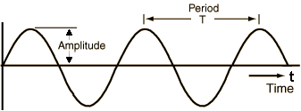
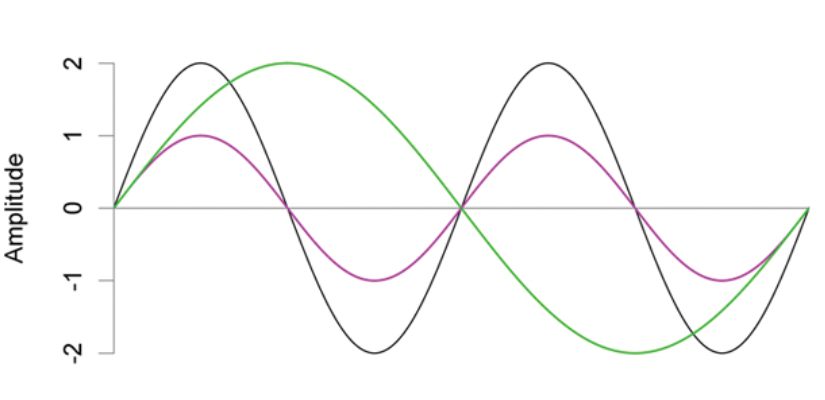
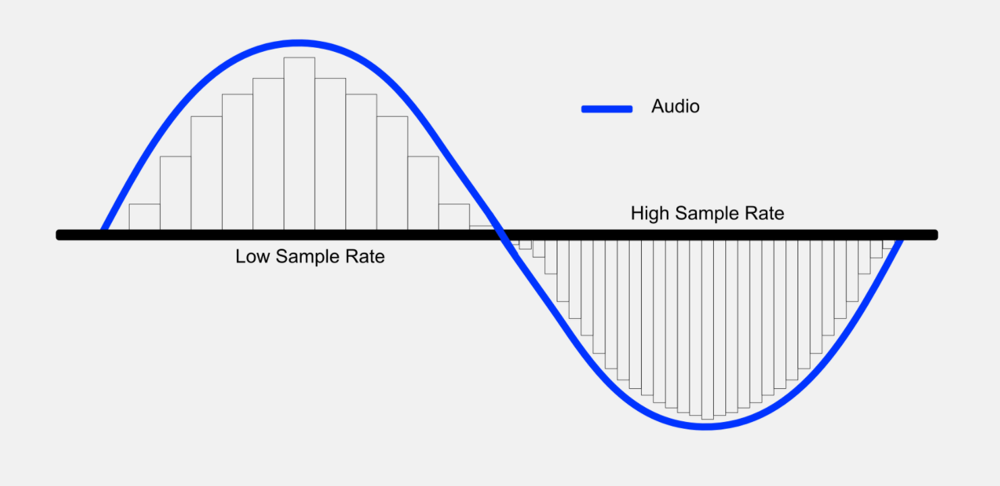

Procesamiento de audio
======================

¿Que es el sonido?
------------------

El sonido humanamente audible consiste en ondas sonoras y ondas acústicas que se producen cuando las oscilaciones de la presión del aire, son convertidas en ondas mecánicas en el oído humano y percibidas por el cerebro. La propagación del sonido se realiza a través de un medio (fluido o sólido) entre el emisor y el receptor. En los fluidos el sonido toma la forma de fluctuaciones de presión mientras que en los cuerpos sólidos la propagación del sonido involucra variaciones del estado tensional del medio.

Características
---------------

Desde el punto de vista del procesamiento de datos, el audio/sonido posee propiedades peculiares que nos interesa resaltar. Las señales de sonido a menudo se repiten a intervalos regulares para que cada onda tenga la misma forma. La altura muestra la intensidad del sonido y se conoce como amplitud. El tiempo que tarda la señal en completar una onda completa es el **período**. La cantidad de ondas producidas por la señal en un segundo se llama **frecuencia**. La frecuencia es la recíproca del período. La unidad de frecuencia es **Hertz**.

  *Simple repeating signal showing Amplitude vs Time*

La mayoría de los sonidos que encontramos pueden no seguir patrones periódicos tan simples y regulares como el que mostramos más arriba. Pero estas señales pueden descomponerse en señales de diferentes frecuencias para crear señales compuestas con patrones repetidos más complejos. Todos los sonidos que escuchamos, incluida nuestra propia voz humana, consisten en formas de onda como estas. Por ejemplo, este podría ser el sonido de un instrumento musical.

  *Simple repeating signal showing Amplitude vs Time*

Representaciones digitales
--------------------------

Al igual que una imagen es representada utilizando la luminosidad de cada pixel en cada canal de color, para digitalizar una onda de sonido debemos convertir la señal en una serie de números para que podamos almacenarla. Esto se hace midiendo la amplitud del sonido a intervalos de tiempo fijos.

Cada una de estas medidas se denomina **muestreo** y la frecuencia de muestreo es el número de muestras por segundo. Por ejemplo, una frecuencia de muestreo común es de aproximadamente 44,100 muestras por segundo, o 44.1 kHz.

  *Sampling rate* `Fuente. <https://www.masteringthemix.com/blogs/learn/113159685-sample-rates-and-bit-depth-in-a-nutshell>`_

.. toctree::
   :maxdepth: 1
   :caption: En esta sección veremos

   tasks