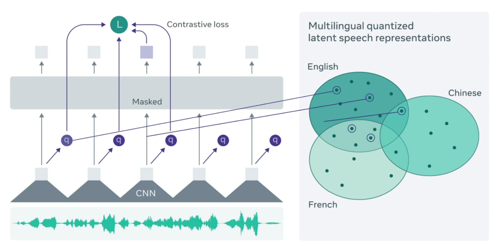

Modelos basados en embeddings
=============================

Los modelos basados en aprendizaje profundo se benefician de grandes cantidades de datos de entrenamiento. Sin embargo, disponibilizar datos etiquetados para aprendizaje supervisado es  mucho más dificil de conseguir que los datos sin etiquetar. Es por esto que los grandes avances en aprendizaje profundo se han dado principalmente cuando se dispone de mecanismos de aprendiaje no supervisado. Muchos modelos de reconocimiento de voz requieren miles de horas de habla transcrita para alcanzar un rendimiento aceptable, lo cual complejida su entrenamiento.

Idea
----
Los modelos de procesamiento de audio basados en embeddings utilizan un marco para el aprendizaje autosupervisado de representaciones a partir de audio sin procesar. Una diferencia importante entre el audio y el texto es que el audio es una señal continua que captura muchos aspectos sin una segmentación clara como pasa con las palabras o los tokens. Los modelos de procesamiento de audio basados en embeddings aborda este problema mediante el aprendizaje de unidades básicas que son más cortas que los fonemas para permitir el aprendizaje de representaciones contextualizadas. Estas unidades se utilizan luego para describir multiples audios y aprender representaciones más robustas.

Dado que este conjunto de unidades es finito, el modelo no puede representar todas las variaciones que se pueden producir. Por el contrario, esta configuración alienta al modelo a centrarse en los factores más importantes para representar el audio.

Arquitectura
-------------
En esta arquitectura, el modelo comienzar por codificar el audio a través de una red neuronal convolucional multicapa. El audio es procesado, en el caso de wav2vec [1]_ , en parches de 25 ms. Estos embeddings son luego procesados por un modelo basado en la arquitectura transformer para construir representaciones contextualizadas. Sin embargo, los embeddings son emascarados antes de enviarlos al modelo transformer. Alrededor del 50% de los embeddings son enmascarados. El modelo entonces utiliza la información de toda la secuencia para reconstruir la entrada (predecir aquellos embeddings que fueron enmascarados) utilizando Constrastive Learning. Note que hasta aquí, la arquitectura es bastante similar a el modo de entrenamiento de BERT.

Una particularidad de esta arquitectura es que la capa de transformer recibe como entrada los embeddings provenientes de la capa convolucional. Sin embargo, debe reconstuir *unidades de audio*. Las unidades de audio son generadas a traves de un proceso de **quantizer** que elije una unidad de discretización que también es aprendida en conjunto por el modelo y que dependerá de las características del audio.

  *Arquitecture de wav2vec 2.0*

**Referencias**

.. [1] `Wav2vec 2.0: Learning the structure of speech from raw audio <https://ai.meta.com/blog/wav2vec-20-learning-the-structure-of-speech-from-raw-audio/>`_

.. toctree::
   :maxdepth: 1
   :caption: Ejemplos

   Wav2Vec 2.0 <wav2vec2.ipynb>
