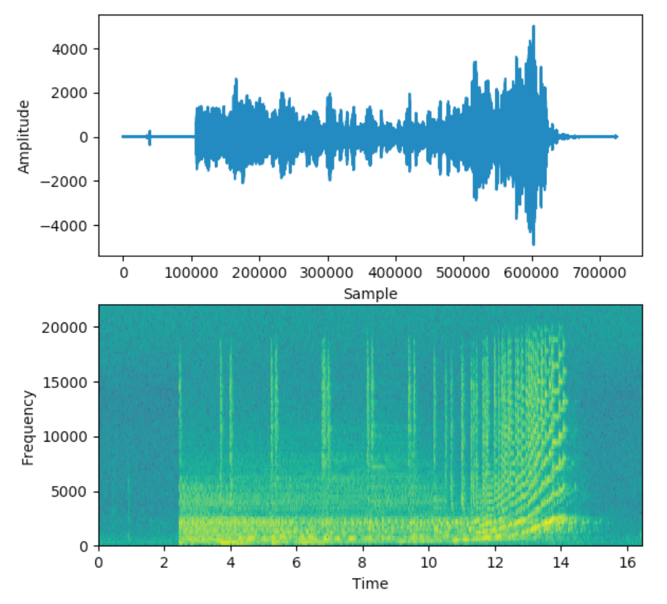

Técnicas basadas en espectrogramas
==================================

Introducción
------------

Como mencionamos anteriormente, una señal de sonido puede ser descompuesta en multiples señales de sonido con determinada frecuencia y amplitud. **El espectro** es el conjunto de frecuencias que se combinaron para producir una señal determinada. Es decir, el espectro traza todas las frecuencias que están presentes en la señal junto con la fuerza o amplitud de cada frecuencia.

.. note:: La frecuencia más baja en una señal se conoce como frecuencia fundamental o *primer armónico*. Las frecuencias que son múltiplos enteros de la frecuencia fundamental se conocen como **armónicos**. Quizás estos conceptos le resulten familiares si estudió música.

Para entender mejor cómo se descompone un sonido en diferentes armónicos, resulta fundamental entender el Análisis de Fourier o análisis armónico, tan estudiado en los cursos de ingeniería:

.. note:: 
    Gracias al teorema de **Fourier**, desarrollado por el matemático francés Fourier (1807-1822) y completado por el matemático alemán Dirichlet (1829), es posible demostrar que toda función periódica continua, con un número finito de máximos y mínimos en cualquier período, puede desarrollarse como una combinación de senos y cosenos (armónicos). 
    
    Desde el punto de vista de la física, significa, que una oscilación que no es armónica se puede representar como una combinación de oscilaciones armónicas, cada una con su propia amplitud, frecuencia y fase. El armónico fundamental es el de frecuencia más baja. Las frecuencias de los demás armónicos serán múltiplos de esta. Además la periodicidad de la oscilación estará dada por el período del armónico fundamental.

  *Esta gráfica representa el sonido con forma de onda cuadrada. El sonido se produce a partir de una nota con frecuencia fundamental f a la cual se añaden armónicos de frecuencias 3·f, 5·f, 7·f, y respectivamente amplitudes 1/3, 1/5 y 1/7.* `Fuente. <https://www.lpi.tel.uva.es/~nacho/docencia/ing_ond_1/trabajos_05_06/io2/public_html/sonido.html>`_

El espectrograma
---------------

Hasta el momento, siemple hemos visto las ondas de sonido representadas en el domino del tiempo, es decir, con el eje X representando el tiempo. Una forma alternativa de representar la misma información es graficar la amplitud de la onda vs las diferentes frecuencias en las que el sonido está descompuesto. Esto describiría el sonido en un momento particular del tiempo.

Los espectrogramas son justamente una forma de integral tal tipo de representación a lo largo del tiempo al producir el espectro del sonido en cada momento. Podríamos decir que esto es análogo a tomarle una fotografía al audio.

    *Sonido representado como amplitudes a lo largo del tiempo y su correspondiente espectrograma*

Esta representación que acabamos de generar quizás le de una idea de en que dirección nos moveremos, ya que hemos transformado un audio en una imagen. La pregunta sería ¿podremos utilizar las técnicas de procesamiento de imágenes que vimos anteriormente en este tipo de imágenes?.

Espectrogramas como imágenes
----------------------------

Dado que podemos interpretar a los espectrogramas como imágenes, resulta atractivo utilizar las mismas técnicas de procesamiento de imágenes para procesar este tipo de dato. 

En general, un modelo de aprendizaje automático que utilice esta técnica hará los siguietnes pasos:
- Disponibilizar los archivos de audio en formato wav. ¿Por qué?. Los formatos como `mp3` o `ogg` son formatos comprimidos que se volvieron populares ya que permiten reducir el tamaño necesario para almacenar información de audio a costa de perder una pequeña calidad en el sonido. Nuestros modelos no pueden trabajar con archivos comprimidos, y por lo tanto los necesitamos en su formato puro, generalmente `wav`.
- Convertir los archivos de audio en espectrogramas.
- Normalizar los archivos de espectrogramas para asegurarnos de que todo nuestro conjunto de datos es compatible. Opcionalmente, podemos aplicar técnicas de *data augmentation* para incrementar la variabilidad de datos que tenemos para entrenarnos.
- Emplear una arquitecturas CNN estándar para procesarlos y extraer predictores.
- Conectar un estimador (como por ejemplo, un clasificador) para resolver el problema que estamos modelando.

Embeddings pre-entrenados
^^^^^^^^^^^^^^^^^^^^^^^^^

De igual forma que hicimos con el procesamiento de texto o de imágenes, a menudo resulta útil utilizar modelos pre-entrenados con grandes conjuntos de datos en lugar de intentar aprender representaciones directamente desde los datos que disponemos. Esto resulta útil cuando los conjuntos de datos que disponemos no son lo suficientemente grandes. En el caso de audio, uno de los modelos más conocidos es YAMNet.

**Conjunto de datos:**
Equivalente a ImageNet, existe un dataset de un gran tamaño sobre el cual entrenar modelos especificamente tratandose de audio. Este conjunto de datos, AudioSet-YouTube corpus consta de una colección de 2,084,320 clips de sonido de 10 segundos con etiquetas (labels) extraídas de videos de YouTube. Estas anotaciones corresponden a 632 diferentes clases que se especifican como un gráfico jerárquico de categorías de eventos, que cubre una amplia gama de sonidos incluyendo anumales, personas, instrumentos musicales y géneros, y sonidos ambientales de la vida cotidiana.

Para más información sobre este set de datos pueden visitar: https://research.google.com/audioset/

.. toctree::
   :maxdepth: 1
   :caption: Ejemplos

   YAMNet <yamnet_class.ipynb>
   