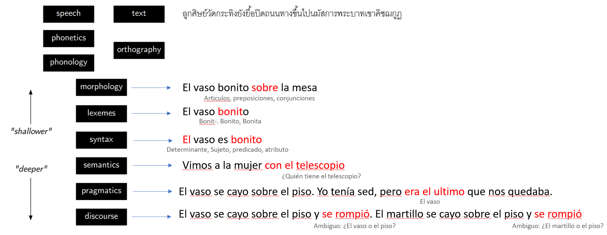

Procesamiento de Lenguae Natural
=================================

    La lengua, producto de la actividad humana, comparte con tal actividad su carácter teleológico o de finalidad. Cuando se analiza el lenguaje como expresión o como comunicación, la intención del sujeto hablante es la explicación que se presenta con mayor facilidad y naturalidad. Por esto mismo, en el análisis lingüístico, debe uno situarse en el punto de vista de la función. Desde este punto de vista, la lengua es un sistema de medios de expresión apropiados para un fin.
    
    -- Trnka et ál. 1980: 30-31.

Niveles de entendimiento
------------------------

La lengua es una totalidad o entidad autónoma en la que todo se encuentra estrechamente interrelacionado. Sin embargo, para su estudio, es útil poder distinguir los niveles que la componen (fonológico, morfológico, léxico, suboracional, oracional y textual), cada uno de los cuales se encuentra
integrado por unidades (fonemas, morfemas, palabras, grupos de palabras, oraciones y textos) que pertenecen a clases delimitadas y contraen entre sí determinado tipo de relaciones.

Aunque estas fronteras metodológicas son bastante útiles en la práctica, no siempre están claras. Según (Blecua 1982: 14), el establecimiento de niveles no es más que una ficción metodológica a la que recurre el lingüista para realizar científicamente la descripción de la lengua. Por este motivo no debe parecer extraño que las fronteras entre los distintos niveles del lenguaje resulten en ocasiones borrosas. La gramática es un sistema altamente integrado, en el que no es posible desvincular por completo sus partes. (Herranz y Brucart 1978: 18).

  *Diferentes niveles de entendimiento del lenguaje*

:Morfología: Hace referencia a las distintas formas que adoptan las palabras de una lengua con independencia de la función que ejerzan dentro de la oración. Más exactamente, de la estructura interna de la palabra.
:Lexemas: Hace referencia a la unidad mínima de una palabra que se caracteriza por aportar significado léxico, frente al morfema que aporta significado gramatical. El lexema de "casa" es "cas-", y "-a" es el morfema.
:Sintaxis: Hace referencia al análisis de las relaciones formales que se establecen en el interior de la oración, tanto desde el punto de vista de la forma como desde el punto de vista del significado entre las palabras que los conforman.
:Semantica: Hace referencia al estudio del signficado de una expresión linguística sin considerar sus factores pragmáticos que tienen implicancias en el significado, como ser características del contexto, convenciones del lenguaje que se usa, el objetivo del narrador, etc. 
:Pragmática: Hace referencia al lenguaje en uso y los contextos en los que se usa, incluidos asuntos como la deixis (palabras cuyo significado depende del contexto, como *aqui*, *yo*, *vos*, *aquel*, etc), la organización del texto, la presuposición y la implicatura (la acción de implicar un significado distinto del sentido literal de lo que se dice explicitamente).
:Discurso: Hace referencia a la unidad de lenguaje que comprende más de una oración. Puede ser clasificado según las elecciones gramaticales y léxicas que se realizan en el discurso, donde encontramos elementos principales y elementos de soporte, un tema, un estilo y un framework de conocimiento y expectativas con los cuales los destinatarios interpretan el discurso. 

Conceptos
---------
Existen algunos conceptos importantes que vale la pena presentar y que utilizaremos a lo largo de toda esta sección. Estos conceptos son propios del procesamiento de lenguaje natural.

:Corpus: Llamamos *corpus* a todo el conjunto de datos sobre el cual un modelo de aprendizaje automático de NLP será entrenado y validado. Representa todo el conjunto de texto disponible. Por ejemplo, en el contexto de un modelo que detecta el sentimiento de las conversaciones telefónicas de un call center, el corpus sería el conjunto de todas las transcripciones de las llamadas telefónica disponibles.
:Documento: Llamamos *documento* a cada una de las porciones de texto que componen el *corpus* y sobre las cuales nuestro modelo de aprendizaje automático debe operar. Es decir, que un *corpus* es un set de *documentos*. Por ejemplo, en el mismo contexto de un modelo que detecta el sentimiento de las conversaciones telefónicas de un call center, un documento sería cada una de las transcripciones disponibles (que corresponden a cada una de las llamadas) y sobre la que se quiere obtener el sentimiento.

.. toctree::
   :maxdepth: 2
   :caption: En esta sección
   :hidden:

   Obtener texto <getting-data.ipynb>