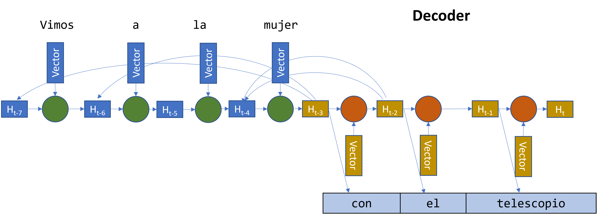
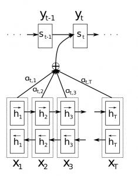

Attention
=========

Motivación
----------

La arquitectura :ref:`rst-encoder-decoder` nos permite entrenar modelos de lenguaje altamente eficientes. Sin embargo, posee una limitación muy aparente. El componente encoder, quien debe capturar una representación útil sobre las palabras anteriores en la secuencia :math:`w _ {1:k}` debe poder codificar una secuencia de longitud variable dentro de un vector de estado de longitud fija. Esto limita la utilidad que puede encontrar el decoder en las representaciones ya que, a medida que la *k* aumenta de tamaño, mayor es la presión y la densidad en el vector interno del encoder y por lo tanto, cuestiones más generales o deben de ser codificadas. 

Arquitectura de encoder-decoder con atención
--------------------------------------------

Una solución para este problema es permiterle al decoder acceder no solo al estado final que genera el encoder, sino que ademas permitirle acceder a los estados intermedios que se generan en cada paso de la secuencia.

  *Permitiendole al decoder acceder a las representaciones intermedias del encoder.*

**Atención o Attention** es una extensión de la arquitectura *encoder-decorder* que permite justamente dos cosas:

-  Proporciona un mecanismo para que el encoder proporcione un contexto más rico para el decoder.
-  Ofrece un mecanismo de aprendizaje donde el decoder puede aprender en que partes de tal contexto más rico debe prestar atención para predecir cada una de las palabras de la secuencia.

.. note:: Attention fué introducido por Dzmitry Bahdanau, et al. en su publicación `Neural Machine Translation by Jointly Learning to Align and Translate <https://arxiv.org/abs/1409.0473>`_ 

    A potential issue with this encoder–decoder approach is that a neural network needs to be able to compress all the necessary information of a source sentence into a fixed-length vector. This may make it difficult for the neural network to cope with long sentences, especially those that are longer than the sentences in the training corpus.

    -- Neural Machine Translation by Jointly Learning to Align and Translate, 2015.

El problema básico que resuelve el mecanismo de atención es que permite que la red acceder a la secuencia de entrada, en lugar de obligarla a codificar toda la información en un vector longitud fija. Interpretado de otra manera, el mecanismo de atención es simplemente una forma de permiter el acceso a una memoria interna, que es el estado interno en el encoder. En esta interpretación, la red elige qué recuperar de la memoria. A diferencia de una memoria en una computadora por ejemplo, el mecanismo de acceso a la memoria aquí es **soft**, lo que significa que la red recupera una combinación ponderada de todas las ubicaciones de memoria, en lugar de un valor particular. Este hecho nos da muchas ventajas a la hora de entrenar la red de punta a punta utilizando el algoritmo de `backpropagation`.

Funcionamiento
^^^^^^^^^^^^^^

En lugar de codificar la secuencia de entrada en un único vector de contexto (de longitud fija), el modelo de atención desarrolla un vector de contexto específicamente creado para cada paso en la secuencia de salida. Este vector se genera de la siguiente forma:

#. El encoder genera las representación final de la secuencia junto con la representaciones internas :math:`h _ i` en cada paso de la secuencia.
#. Para cada paso de la secuencia, se genera un vector de aliniamiento o afinidad :math:`e _ i` que mide "que tan alineada" está la salida del encoder :math:`h _ i` con la salida del decoder en la posición que se está generando :math:`s _ t`. 
#. El vector :math:`e _ i,t` es pasado por una función *softmax* para generar una distribución probabilística indicando **la probabilidad de que la palabra en la posición i sea relevante para predecir la palabra en la posición t**. Este vector se lo suele llamar :math:`a _ t` y cuando tiene valores grandes indica que el decoder debe de prestar mucha atención a esta palabra cuando intente predecir la palabra :math:`w _ t`
#. Se genera un vector de contexto que es la multiplicación de :math:`a _ t` con la salida original del encoder :math:`h _ i`. El vector resultante es una ponderación de las representaciones de la secuencia, no solo de representación per-se. 
#. Luego, el decoder realiza la predición de la siguiente palabra basandose en el vector de contexto generado.

  *Estructura interna de una red RNN con un modelo de atención.*

Implicaciones
-------------
Si miramos un poco más de cerca cómo funciona el método de attention, podemos ver quen tiene un costo no despreciable. Necesitamos calcular un valor de atención para cada combinación de palabra de entrada y salida. Si, por ejemplo, tenemos una secuencia de entrada de 40 palabras y generando una secuencia de salida de 40 palabras, esto representaría 2500 valores de atención calculados. A priori no pareciera ser un problema, pero a medida que las longitudes de las secuencias se hacen más grandes los mecanismos de atención pueden volverse prohibitivamente costosos.
