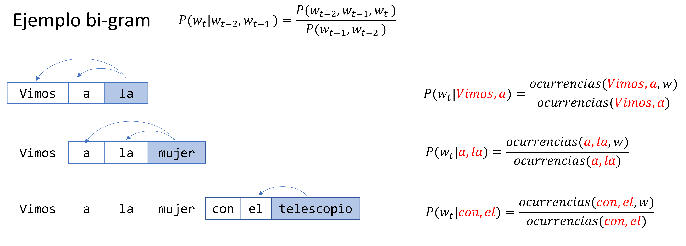
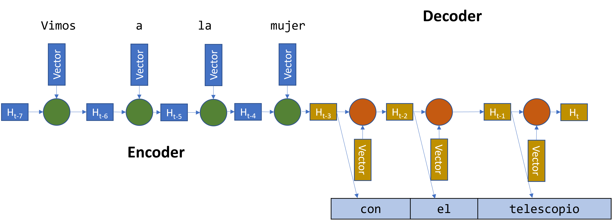

.. _rst-neural-language-model:

Modelos de lenguaje neurales
============================

.. _rst-language-model:

Modelos de lenguaje
-------------------
Decimos que un modelo de lenguaje es un modelo que asigna una probabilidad a oraciones de un idioma. Es decir, es una distribución probabilística. No solo asigna una probabilidad a cada secuencia de palabras, sino que también asignan una probabilidad de que una palabra sea la siguiente en una secuencia de palabras (¿cuál es la probabilidad de ver la palabra *ladró* después de la secuencia *el perro*?). Llamamos **modelado del lenguaje** a la tarea particular que resuelven este tipo de modelos.

Obtener una performance en la tarea de modelado de lenguaje similar a la que obtendría una persona, es decir en predicir la siguiente palabra dada una secuencia de palabras arbitraria, es extremandamente compejo y dificil de alcanzar en el futuro cercano. A pesar de esto, los modelos de lenguaje cumplen un factor fundamental en los componentes de aprendizaje automático para NLP en las organizaciones hoy en día.

Formalmente, la tarea de modelado de lenguaje asigna probabilidades a una secuencia de palabras :math:`w _ {1:n}` para estimar la probabilidad :math:`P(w _ {1:n})`, la cual según la regla de la cadena:

.. math::
    P(w _ {1:n}) = P(w _ 1)P(w _ 2 | w _ 1)P(w _ 3 | w _ {1:2})P(w _ 4 | w _ {1:3}) ... P(w _ n | w _ {1:n-1})

Esto no es más que una tarea de predicción de secuencias donde la predicción de cada palabra está condicionada por todas las palabras que aparecieron anteriormente. Como se puede intuir, la tarea de predecir :math:`P(w _ n | w _ {1:n-1})` es tán difícil como la de predecir la oración completa y es por eso que los modelos de lenguaje suelen hacer uso de la suposición de la propiedad Markov.

.. note:: En una secuencia, la propiedad de Markov establece que el futuro es independiente del pasado para un dado presente. Más formalmente, decimos que la siguiente palabra solo depende de las ultimas *k* palabras de la secuencia (Propiedad de Markov de orden *k*)

A pesar de que claramente la propiedad de Markov es incorrecta en la tarea de modelado de lenguaje, aún nos permite generar modelos de lenguaje con performance excelentes para valores relativamente bajos de *k*. 

Performance de un modelo de lenguaje
------------------------------------

Existen varias métricas para evaluar un modelo de lenguaje. Los métodos extrínsecos utilizan la tarea o la aplicación final del modelo para estimar la performance, por ejemplo, midiendo la mejora en la calidad de la traducción en modelo que traduce de un idioma a otro. 
Los métodos intrínsicos utilizan una tarea especifica, o una tarea intermedia (proxy) que captura esencialmente lo que queremos medir.
. Una de tales tareas es medir la perplejidad sobre oraciones que el modelo no ha visto. La perplejidad es una métrica del campo de la Teoría de la información que mide qué tan bien un modelo probabilístico predice una observación. Valores bajos de perplejidad indican un mejor ajuste.

Modelos de lenguaje buenos asignarán probabilidades altas a secuencias de texto que están dentro del cuerpo de texto y por lo tanto tendrán un valor de perplejidad bajo (bueno). Este punto es importante porque nos indica que la perplejidad es una métrica especifica de un determinado copus, por lo tanto 2 modelos deben de compararse sobre el mismo corpus.

Generación de modelos de lenguaje
---------------------------------

Métodos tradicionales
^^^^^^^^^^^^^^^^^^^^^

La forma tradicional de resolver este problema es utilizando n-gramas. En un modelo de lenguaje basado en n-gramas, la probabilidad de la secuencia de palabras es el producto de cada una de las probabilidades de las palabras. 

.. math::

    P(w _ 1, w _ 2, ..., w _ n) = \prod_{i=1}^n P(w _ i | w _ {1:i-1})

Sin embargo, haremos una simplificación importante: supondremos que la probabilidad de una palabra dada, solo depende en las k palabras anteriores. Entonces, suponiendo la propidad de Markov de orden *k* podemos modelar :math:`P(w _ {i+1} = m | w _ {1:i}) \approx P(w _ {i+1} = m | w _ {i-k:i})`. Las estimaciones de estas probabilidades son generalmente derivadas de sus cantidades dentro del corpus.

  *Modelos de lenguaje utilizando n-gramas.*

A pesar de que este método es efectivo, tiene limitaciones muy claras. Por ejemplo, si una secuencia de palabras nunca se sucede en el corpus, entonces el modelo le asignará probabilidad 0, lo cual a su vez, debido a la multiplicación se propagará a todo el corpus. Para evitar este problema, generalmente se utilizan técnicas de suavizado o smoothing para asignarle probabilidad bajas a eventos raros.

Otro problema de estos métodos tiene que ver con encontrar un valor de *N* adecualdo. Si N es pequeño, entonces perdemos contexto que es importante (sesgo alto). Si N es grande, casi cualquier secuencia será única (alta varianza) y peor será el problema de secuencias de probabilidad baja que mencionamos anteriormente resultando en modelos poco densos (sparcity). Adicionalmente, *N* grandes implican requerimientos de cómputo mucho mayores.

Finalmente, un problema más serio es el hecho de que los modelos basados en n-gramas no pueden generalizar en distintos contextos. Un modelo que observó ocurrencias de "auto blanco" y "auto negro" no podrá generalizar a "auto rojo" a menos que haya visto una ocurrencia de esta combinación.

Métodos neurales
^^^^^^^^^^^^^^^^

Los modelos neurales solucionan muchos de los problemas mencionados anteriormente. Sobre todo permiten calcular probabilidades condicionandas a contextos más grandes sin aumentar exponencialmente el número de parámetros y soportan la generalización de forma mucho más amplia. Estas propiedades hacen que los modelos puedan incorporar de forma muy flexible contextos que pueden ser muy interesantes. Por ejemplo, [Devlin et al (2014)] propone la utilización no solo de las ultimas *k* palabras para predecir la próxima en la secuencia, sino que también *m* palabras en un texto de contexto que le permite al modelo ser más sencible a vocabulario específico que puede haber en el texto.

Aquí, la entrada de la red neural es una secuencia de *k* palabras :math:`w _ {1:k}` y la salida es la distribución probabilistica para la siguiente palabra de la secuencia. :math:`w _ {1:k}` es tratado como una ventana de palabras que definen el contexto para cada palabra *w*, siendo cada una de ellas representada por un vector (embedding). El contexto :math:`w _ {1:k}` es la concatenación de los *k* vectores de cada palabra.

La forma típica de entrenar estos modelos es utilizando la arquitectura :ref:`rst-encoder-decoder`:

  *Arquitectura de RNN de tipo encoder-decoder.*

Limitaciones
------------

A pesar de que los métodos neurales son potentes, también tienen sus limitaciones. Principalmente relacionado con los requerimientos computacionales que presenta a la hora de predecir la siguiente palabra en una secuencia. En algunos casos estos modelos podrían volverse prohibitivos si el tamaño del vocabulario es grande. Adicionalmente, su capacidad de generalización puede ser un problema en algunos casos. Si bien los modelos neurales pueden generalizar por ejemplo "perro negro" habiendo visto oraciones como "perro blanco" y "perro gris"; también pueden generalizar asignandole una alta probabilidad a "perro verde" a pesar de que es poco probable ver un perro verde. (sin tener en cuenta la frase "mas raro que perro verde").

.. toctree::
   :maxdepth: 1
   :caption: En esta sección veremos

   Modelos de lenguaje con Attention <attention>
   Modelos de lenguaje con Transformers <transformers>
   Grandes Modelos de Lenguaje <llm>

