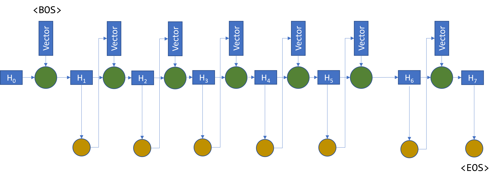

Redes Neurales Recurrentes
==========================

Introducción
------------

No es el objetivo de este curso revisar como funcionan las arquitecturas neuronales basadas en redes recurrentes. Sin embargo, vale la pena mencionar algunos puntos a destacar. Una *RNN* está definida de forma recurrente, como una función **R** que toma como entrada un vector :math:`h _ {i-1}` junto con un vector de entrada :math:`x _ i` y devuelve un nuevo estado :math:`h _ i` El vector de estado :math:`h _ i` luego se puede conectar con otars capas de una red neuronal.

  *Modelos basados en secuencias de redes neuronales recurrentes con texto*

En la imagen anterior, la red está "desdoblada" dada su naturaleza recurrente, lo cual le permite acomodarse a secuencias de longitud arbitraria. Sin embargo, nosotros siempre trabajaremos con secuencias que son finitas.

.. note:: Es importante aquí notar que todos los parametros que se aprenden en la red son compartidos en cada paso de la secuencia. Es decir que una RNN es un grafo de computo complejo - mas que una red neuronal profunda - donde diferentes **partes** de la entrada son insertadas en diferentes capas de la red.

Entrenamiento
-------------

Las redes de tipo RNN se entrenan utilizando el algoritmo de propagación hacia atrás, o *backpropagation* para computar los gradientes con respecto a una función de perdida que se debe indicar dependiendo del problema a resolver. Este procedimiento se lo conoce como **backpropation through time (BPTT)**. Es importante entender de todos modos que las redes RNN son simplemente una pieza de una red neuronal más grande y compleja, que nos permite imponer estructura en los parámetros que estamos apendiendo. Esto le permite a la red, y en particular a las capas de tipo RNN a aprender pesos que son útiles para resolver la tarea en particular.

Arquitecturas
-------------

Encoder
^^^^^^^

Una de las formás más sencillas de utilizar esta idea es simplemente utilizando el vector resultante de la red RNN. De esta forma al modelo observa el estado final al que ha arrivado la red y toma una decisión dependiendo del caso a resolver. Tipicamente este vector resultante es conectado a una capa densa (fully connected layer) para general la predicción. Los grandientes de los errores son propagados en la red para toda la secuencia y suele ser cualquier función típica como ser `cross entropy`, `hinge`, etc.

  *Arquitectura de RNN de tipo encoder para clasificar un texto de acuerdo al sentimiento.*

En frameworks como `TensorFlow y Keras`, podemos consturir este tipo de redes de la sigueinte forma:

.. code:: python

  import tensorflow.keras as keras
  from tensorflow.keras.models import Sequential, Model
  from tensorflow.keras.layers import Embedding, LSTM, Dense, SpatialDropout1D

  model = Sequential([
        Embedding(...),
        SpatialDropout1D(0.2),
        LSTM(hidden_state_size),
        Dense(number_of_classes, activation='softmax')
    ])

El ejemplo anterior construye una red para resolver un problema de clasificación utilizando las siguientes capas:

- **Embedding:** Esta capa transforma vectores que representan indices dentro de una matriz en representaciones vectoriales densas. Básicamente en este caso nos resolverá la busqueda de las representaciones vectoriales para nuestras palabras.
- **SpatialDropout1D:** Este tipo de capas ayudan a promover la independencia entre filtros (feature maps). Funciona en forma análoga a `Dropout` pero en lugar de desconectar elementos individuales, desconecta el filtro completo.
- **LSTM:** Long Short-Term Memory layer - Hochreiter 1997
- **Dense:** Una típica capa de una red neuronal completamente conectada (fully connected)

.. warning:: La utilización de capaz de tipo `dropout` puede ser un poco peligroso cuando trabajamos con secuencias ya que **desconectar** diferentes neuronas en diferentes niveles podría dañar la capacidad de una red RNN de llevar información de una parte de la secuencia a otra. Tipicamente debíamos aplicar esta técnica en capas de la red que no sean recurrentes. Más recientemente surgió otra alternativa que es mantener la misma desconección a lo largo de todas los niveles de la red RNN. Esto quiere decir que la mascara de dropout se muestrea una sola vez por oración, en lugar de una vez por cada paso. El resultado es que si una palabra es descartada, la red no podrá accederla para niguna de las conexiones en cualquiera de los pasos (unfolds) de la red. En Keras, esto se implementa a través de `SpatialDropout`.

.. toctree::
   :maxdepth: 1
   :caption: Ejemplos
   
   Ejemplo: Modelo de encoder <sequences-encoder.ipynb> 
   Ejemplo: Modelo de encoder con embeddings Word2Vec <sequences-word2vec.ipynb>

.. _rst-transducer:

Transducer
^^^^^^^^^^

Otra forma de utilizar estas estructuras es permitiendole a la red generar una salida :math:`\hat{t} _ i` por cada vector de entrada que lee. De esto froma, podemos computar una señal de perdida para cada una de las salidas de :math:`\hat{t} _ i` con respecto al valor verdadero de la secuencia que es  :math:`t _ i`. Luego, todas estas pérdidas se suman o se promedian para convertirse en la señal que finalmente se propaga.

Un caso típico de su uso es para las tareas de modelado de lenguage (tema que veremos más adelante) donde utilizamos las palabras :math:`x _ {1:i}` para predecir la palabra :math:`x _ {i+1}`. Casos especiales de esta forma de utilizarlas son las arquitectura de **encoder-decoder** y las arquitecturas de **attention**.

  *Arquitectura de RNN de tipo encoder para clasificar un texto de acuerdo al sentimiento.*

En frameworks como `TensorFlow y Keras`, podemos consturir este tipo de redes de la sigueinte forma:

.. code:: python

  import tensorflow.keras as keras
  from tensorflow.keras.models import Sequential, Model
  from tensorflow.keras.layers import Embedding, LSTM, SpatialDropout1D, TimeDistributed, Activation

  model = Sequential([
        Embedding(...),
        SpatialDropout1D(0.2),
        LSTM(hidden_state_size, return_sequences = True),
        TimeDistributed(Dense(vocabulary_size, 'softmax')),
    ])

.. note:: Notar que en el ejemplo anterior, tanto la entrada como la salida son secuencias de palabras salvo que la salida es la misma secuencia que la entrada pero una palabra un paso más adelante.

El ejemplo anterior construye una red para resolver un problema de :ref:`rst-language-model`. A diferencia del ejemplo anterior, aquí vemos el uso del parámetro `return_sequences=True` que hace que la salida de esta capa tenga dimensiones `(batch_size, time_steps, hidden_state_size)`, donde `time_steps` es la longitud máxima de la secuencia. Una capa `TimeDistributed` se agregó ya que necesitamos que la operación `Dense` se ejecute por cada una de las palabras de la secuencia. Es por eso que el vector `y`, es decir nuestras etiquetas, son una secuencia de palabras.

.. _rst-rnn-generator:

Generator
^^^^^^^^^

La arquitectura de :ref:`rst-transducer` resulta útil para la implementación de modelos de generación de lenguaje. Utilizando esta arquitectura base, la generación de texto puede realizarce al conectar la salida del transducer en la posición *i* con la entrada de la posición *i+1*, es decir, despues de predecir la distribución de las palabras que irían en la posición *i*. Una palabra se muestrea de tal distribución y se injecta como entrada en el siguiente paso. La imágen a continuación muestra su funcionamiento:

  *Arquitectura de RNN de tipo generator para la generación de texto no condicionado.*

Al momento de realizar el muestreo de la palabra en cada posición del transducer podemos o bien muestrear la palabra basandonos en la distribución de salida o realizara una búqueda para encontrar una salida global de la oración que sea altamente probable.

Los generators son altamente potentes para generar secuencias de texto coherentes. En general, estos modelos se entrenan al nivel de caracteres lo cual los fuerza a buscar relaciones en la secuencia en posiciones mucho mas alejadas que cuando se entrenan sobre palabras. La tarea de entrenar un modelo cuyo objetivo es predecir la probabilidad del siguiente simbolo (caracter o palabra) de una secuencia se llama :ref:`rst-language-model`.

.. toctree::
   :maxdepth: 1
   :caption: Ejemplos

   Ejemplo: Generators utilizando Keras <sequences-generator.ipynb>

.. _rst-conditioned-generator:

Conditioned Generator
^^^^^^^^^^^^^^^^^^^^^

Aunque la posibilidad de generar texto utilizando un :ref:`rst-rnn-generator` parece interesante, su verdadero potencial se evidencia cuando queremos generar texto de forma condicionada. Esto se conoce como una estructura *Encoder-Decoder*. En una configuracion de :ref:`rst-rnn-generator` generamos un token :math:`w _ {i+1}` basandonos en los tokens previamente generados :math:`w _ {1:i}`. En una configuración de generación de texto condicionada, el siguiente token :math:`w _ {i+1}` es generado basandose en los token previamente generados :math:`w _ {1:i}` y en un context *c*, generalmente representado a traves de un vector. Este vector es en cada paso concatenado con la entrada de la red RNN para luego generar la predicción.

**¿Qué clase de información se puede codificar en el vector de contexto?** Cualquier información puede codificarse en este vector. Podrían ser por ejemplo tópicos para la generación de texto condicionado a un tópico en particular. Incluso podríamos condicionar en propiedades que son derivadas de los mismos datos. Por ejemplo, podría condicionar durante entrenamiento basandonos en el tiempo verbal del texto en cuestión para luego, durante el proceso de generación, poder controlar el tiempo verbal del texto que la red genera. En un sistema que genere respuestas de un dialogo, podría codificar características de cada usuario como por ejemplo el estilo al hablar.

Cuando el vector de context *c* es generado por una red RNN, este tipo de modelos se los llama :ref:`rst-seq2seq` y esta arquitectura :ref:`rst-encoder-decoder`.
