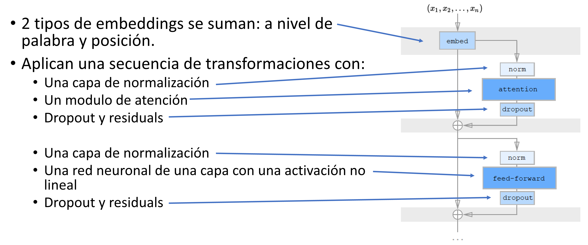

Transformers
============

Introducción
------------

La utilización de :doc:`attention` a permitido a los modelos de lenguaje basados en NLP a escalar utilizando secuencias de texto verdaderamente largas y por consiguiente, poder mapear relaciones y dependencias en el texto que se sucede a gran distancia las unas de las otras. Sin embargo, la arquitectura de attention claramente solo araño la superficie de lo que realmente era posible y esta idea se llevo mucho más a fondo utilizando Transformers.

Modelos como :ref:`/nlp/neural/sequences-word2vec.ipynb` son "context-free", lo que significa que cada palabra recibe un único vector que la representa. Esto implica que por ejemplo la palabra "banco" recibirá la misma representación en las oraciones *Los domingos no abre el banco* y *Estabamos tan cansados que nos sentamos en un banco*.

Los `Transformers`, por el contrario explotarán la capacidad de la arquitectura de :doc:`attention` al convertir las representaciones en **contextuales**, lo que significa que la representación que se genera de una palabra depende del contexto en el que aparece.

Como funcionan
--------------

Si recordamos de cuando introducimos :doc:`../vectorization/embeddings`, vimos que las representaciones de las palabras se obtenian al entrenar una red neuronal en una tarea "falsa" que era predecir una palabra dado el contexto en el que aparece. Este contexto lo especificabamos como una ventana de palabras. Los modelos basados en lenguaje, llevan esta tarea un paso más adelante y tratan de predecir la siguiente palabra dada una secuencia de palabras. Esta estrategía en principio simple ha demostrado capturar cierto grado de "entendimiento" en grandes modelos de lenguaje[1]_.

En el caso de los transformers (en general - ya que depende mucho de la implementación), está pre-entrenado utilizando 2 tareas distintas:

- **Masked LM:** Están basados en una técnica llamada Masked LM (MLM) la cual, en lugar de intentar predecir la siguiente palabra dada una secuencia de palabras, aleatoriamente enmascara palabras en la oración para luego intentar predecirlas desde el contexto. Para hacerlo utiliza el contexto completo de la oración, tanto hacia adelante como hacía atras (bidireccional). Modelos como :ref:`/nlp/neural/BERT.ipynb`, en la práctica, enmascara aproximadamente el 15% de los tokens en una secuencia.
- **NSP (Next Sentence Prediction):** Muchas tareas en NLP requieren el entendimiento de las relaciones entre varias oraciones o secuencias. Los transformers capturan estas relaciones al estar entrenado para predecir la siguiente oración en el cuerpo. En el caso de :ref:`/nlp/neural/BERT.ipynb` utiliza 50% del tiempo efectivamente la siguiente oración para la tarea de NSP y la taguea con el token IsNext, mientras que el otro 50% utiliza una oración aleatoria del texto y la taguea con el token NoNext.

Arquitectura
------------

En general, la arquitectura común de los modelos basados en Transformers es la siguiente. Cada implementación tiene detalles que quizás los diferencia a los diferentes modelos que se pueden encontrar, como ser BERT, GPT-2, etc. Sin embargo, todos comparten los mismos componentes centrales.

  *Permitiendole al decoder acceder a las representaciones intermedias del encoder.*

.. [1] `Large Language Models are Zero-Shot Reasoners <https://arxiv.org/abs/2205.11916>`_.

.. toctree::
   :maxdepth: 1
   :caption: En esta sección veremos
   :hidden:

   BERT: Bidirectional Encoder Representations from Transformers <BERT.ipynb>
   BERT en un problema de clasificación <BERT_classification.ipynb>
   BERT en un problema de clustering <bertopic.ipynb>
