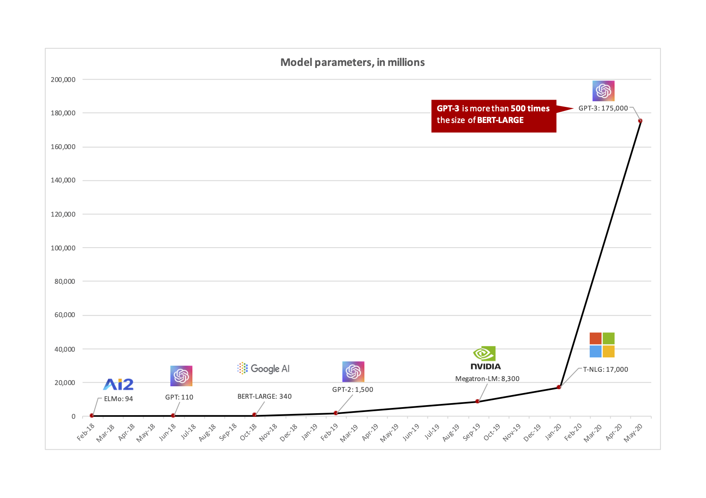

Estado del arte
===============

La era de los transformers
--------------------------

Existe una nueva generación de modelos que están cambiando drasticamente la performance de las tareas relacionadas en NLP. Todo estos modelos, como GPT-3, T5, BART, Turing comparten la misma arquitectura basada en :doc:`neural/transformers` y muestran una gran performance como también un gran tamaño en el modelo resultante.

  *Número de parámetros en cada uno de los últimos modelos de lenguaje para NLP (2021).*

Esto incluso ha hecho que se diseñen nuevas formas de medir la performance de un modelo de un modelo de NLP. La tradición métrica `General Language Understanding Evaluation (GLUE) <https://gluebenchmark.com/>`_ , la cual mide la performance de un modelo de NLP sobre 9 diferentes tareas que miden diferentes aspectos del lenguaje sobre diversos conjuntos de datos y con distintas dificultades, dejó de ser útil cuando T5 en 2020 supero la linea base que puede alcanzar una persona. Esto hizo que se debiera generar una nueva métrica, SuperGLUE la cula trata de medir tareas más complejas como lógica, entendimiento del sentido común y la semántica léxica.

  *Glue y SuperGLUE para diferentes modelos. Fuente: stateof.ai 2020.*

Número de parámetros y poder de cómputo [1]_
--------------------------------------------

Según `State of AI Report 2020 <https://www.stateof.ai>`_, los modelos de gran tamaño en las compañías de tecnología mas grandes del mundo están dominando el espacio de NLP, aunque al mismo tiempo, utilizan costos astronómicos en cómputo para entrenar estos modelos. Y es que la experiencia sugiere que la relación entre la performance del modelo, el número de parametros y el poder de cómputo necesario para entrenarlos sigue una relación exponencial, signficando que a medida que la performance del modelo sube, también lo hacen, aunque más rápidamente, su tamaño y la cantidad de computo necesaria. 

  *Modelos más grandes, conjuntos de datos más grandes y más compute empujan mejor performance.*

Y es que realizar el entrenamiento de estos modelos masivos cuesta millones de dolares. Según un estudio de *Google et al*, el costo promedio de entrenamiento de un modelo de NLP es de $ 1 USD por cada 1000 parámetros. Esto quiere decir que entrenar un modelo como por ejemplo **GPT-3** costaría en el oden de **$ 10.000.000 USD**. 

Esto es bastante cercano a la estimación que hace *Google* donde indican que entrenar el modelo T5 con alrededor de 11B parámetros costó bastante más que $ 1.3 millones de dolares. Asumiendo que entrenar un modelo generalmente requiere entre 2-3 procesos de entrenamiento más multiples más, aunque más pequeñas, esta cifra es cercana a **$ 10.000.000 USD**. 

No solo para los Google's, Microsoft's o Facebook's [2]_ [3]_
-------------------------------------------------------------

Si bien la experiencia muestra que conjuntos de datos más grandes son beneficisos para estos modelos masivos, para algunos casos de uso, los modelos que utilizan los datos más eficientemente terminan siendo los ganadores. Por ejemplo, la compañia `PolyAI <https://poly.ai>`_ basada en Londres liberó el código de su modelo `ConveRT`, un modelo basado en transformers. Este modelo mostró una performance superior al modelo BERT de Google en el contexto de aplicaciones conversacionales (bot). Incluso, el modelo es más eficiente cuando la cantidad de datos es escasa.

  *Performance del modelo ConveRT versus otros modelos del mercado en la tarea de re-rankeo contextual. Fuente: https://stateof.ai*

**Referencias:**

.. [1] `Scaling Laws for Neural Language Models <https://arxiv.org/pdf/2001.08361.pdf>`_
.. [2] Source: https://github.com/PolyAI-LDN/polyai-models
.. [3] Source: https://github.com/PolyAI-LDN/conversational-datasets 
