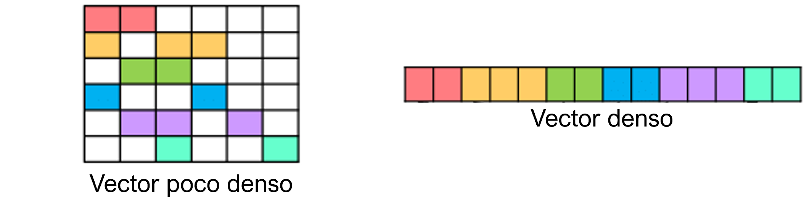
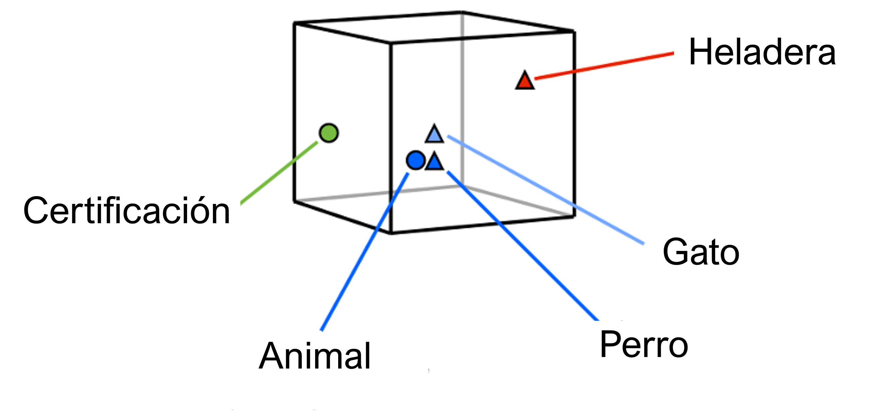

Vectorizado con vectores densos (embeddings)
============================================

Introducción
------------

Los métodos anteriores de vectorizado tenian la peculiaridad de que **cada característica o predictor tenía su propia dimensión** y por lo tanto representaban vectores poco densos. Esto quiere decir que tendremos tantas dimensiones como características, predictores o mejor dicho, palabras. La ventaja y desventaja que tiene esta representación es que cada característica es independiente de las restantes. El predictor que corresponde a la palabra *perro* es tan distinto al vector que corresponde a *gato* como lo es al que corresponde con *heladera*.

Una alternativa a esta es **dejar de representar a nuestros predictores en su propia dimensión para pasar a representarlos como vectores densos**. Esto significa que cada predictor está códificado y embebido en un vector de dimensión d-dimensional (de aquí porque reciben el nombre de embeddings). La dimensión *d* es en general mucho más pequeña que el número de predictores - en el orden de 100-300.

  *Diferencia entre vectores densos y poco densos*

Como consecuencia, las representaciones tienen una dimensionalidad menor pero más aún, un poder de generalización mas grande ya que si creemos que dos palabras serven el mismo proposito o tienen un significado similar, debereríamos de asignarles el mismo vector y permitirle al modelo compartir significancia estadística a ambas palabras por igual.

  *Ejemplo de vectores densos y sus posiciones en el espacio - manifold*

Aquí, sin embargo, hay una suposición importante y es que las representaciones de las palabras **son buenas**. Tales representaciones requeriran una cantidad de datos importante para ser útiles, y es por eso que en general utilizaremos *embeddings* preentrenados para nuestros modelos.

.. note:: Los vectores densos también serán útiles cuando utilicemos modelos basados en redes neuronales, los cuales no suelen funcionar correctamente con vectores altamente dimensionales y poco densos.

.. _rst-distributed-representations:

Representaciones distribuidas
-----------------------------

Un enfoque distinto al de los métodos de vectorizado basados en cantidad de palabras es utilizar el concepto de respresentaciones distribuidas. Cuando trabajamos con respresentaciones distribuidas, cada palabra está asociada con un vector multidimensional donde el significado de la misma no solo está codificado en las diferentes dimensiones de este vector, sino que también en las dimensiones de otras palabras (otros vectores). Esto quiere decir que, por ejemplo el vector "perro" cobra significado no solo por su representación, sino que también por su representación relativa a la palabra "gato", "animal", etc. Note también que aquí las diferentes dimensiones de las representaciones carecen de un significado específico sino que es el espacio resultante al que le podemos atribuir significado.

Similaridad
^^^^^^^^^^^

Una vez que tenemos representaciones de vectores, podemos computar la similaridad entre diferentes palabras computando la similaridad entre sus respectivos vectores. Una de las métricas más comunes para medir la similaridad es la *similaridad del coseno* o *cosine similarity* la cual mide el coseno del angulo entre dos vectores dados:

.. math::

  sim(u,v) = \frac { u \cdot v } {\lVert u \rVert _ 2 \lVert v \rVert _ 2}

Otra métrica comunmente utilizada e la *similaridad de Jaacard generalizada*.

Algoritmos para aprender representaciones densas
------------------------------------------------

Existen diferentes formas para aprender estas representaciones. Las técnicas en general se basan en aprendizaje supervisado, pero en lugar de supervisar la tarea que nos importa, creamos un conjunto de datos prácticamente ilimitado a partir de texto crudo para diseñar otra tarea supervisada con la esperanza de que las mismas sean informativas para resolver la tarea final que necesitamos.

La idea clave detrás de este enfóque es obtener un método donde palabras "similares" reciban vectores similares. Si bien la similitud de palabras es difícil de definir y suele depender de la tarea, en general utilizaremos la hipótesis de :ref:`rst-distributed-representations` [Harris, 1954], afirmando que las palabras que son similares aparecen en contextos similares. Para cumplir este objetivo, la idea es predecir una palabra a partir de su
contexto, o predecir el contexto a partir de la palabra. 

Existen diversos algoritmos que utilizan este enfoque, cada uno con detalles de implementacion distintos:

- **Word2Vec:** Es en realidad una familia de algoritmos que se introdujo por primera vez en [Mikolov et al., 2013] y popularizado por Google, el cual está diseñado para tener las mismas propiedades que un :ref:`rst-language-model`, pero utilizando una metodología mas eficiente. Veremos en más detalle :ref:`/nlp/vectorization/Word2Vec.ipynb`. 
- **GloVe:** Es un algoritmo introducido por [Pennington et al., 2014] y popularizado por Stanford Univeristy, que persigue un objetivo similar a Word2Vec pero que está basado en factorización de matrices [Levy and Goldberg, 2014].
- **fasttext: ** Se trata de un modelo introducido por Facebook en el 2016 como una versión mejorada y extendida de la idea original de *Word2Vec*. La librería `gensim.models.fasttext` dispone de esta implementación.

Embeddings pre-entrenados
-------------------------

Muy frecuentemente no dispondremos de cuerpos de texto lo suficientemente grandes como para entrenar nuestro propio `embedding` de palabras o quizás no disponemos de los recursos de hardware necesarios para llevarlo a cabo. En estos casos, podemos recurrir a utilizar modelos que han sido anteriormente entrenados en otro cuerpo de texto y reutilizarlos para nuestra tarea.

Si utilizamos embeddings pre-entrenados, hay algunas consideraciones que se deben tomar. La primera elección tiene que ver con el :doc:`../preprocessing/intro`. ¿Que tipo de preprocesamiento es necesario en el texto para tener un vocabulario similar al que utilizó el algoritmo del modelo pre-entrenado? 

La siguiente elección es de que manera se van a utilizar estos embeddings: utilizando *fine-tuning* o utilizandolos como *feature-extrators*. Una estrategia común es tratar los pesos de los embeddings como cualquier otro parametro de la red y por lo tanto actualizarlos de acuerdo a la tarea en cuestión. Si bien esto funciona bien, tiene el efecto lateral/potencial de cambiar las representaciones de las palabras en direcciones no compatibles con las que fué entrenado originalmente. Esto podría dañar la capacidad de generalización del modelo.

Otra alternativa es mantener los pesos de los embeddings congelados y utilizar entonces al modelo como un *feature-extrator*. Esto tiene el beneficio de que las representaciones mantienen sus relaciones originales, pero puede hacer que el modelo tenga problemas para utilziar las representaciones en la tarea específica dada. Por ejemplo, si los palabras "caliente" y "frio" reciben vectores similares, entonces el modelo podría tener problemas para separar estos dos conceptos. En :ref:`/nlp/neural/sequences-word2vec.ipynb` veremos un ejemplo de como lograr esto.

.. toctree::
   :maxdepth: 1
   :caption: En esta sección veremos
   :hidden:

   Representaciones de Word2vec <Word2Vec.ipynb>