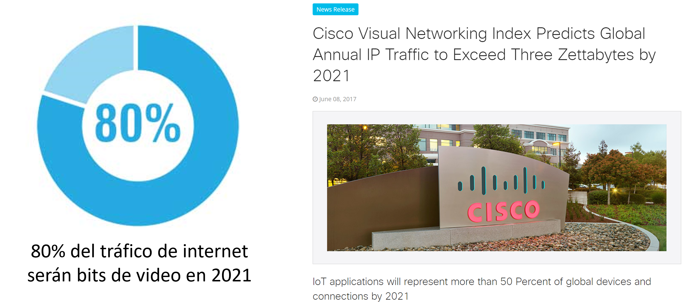
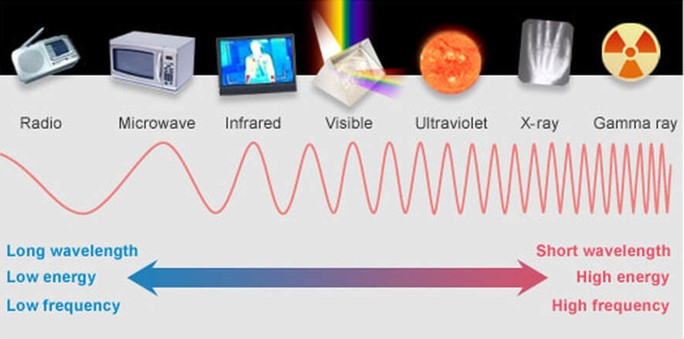

Procesamiento de imagenes
=========================

Introducción
------------

El campo de **Visión por computadora** puede resultar difícil de definir ya que se encuentra en la intercepción de muliples disiplinas como son las **ciencias de la computación**, la **física** y la **matemática**. En su forma más sencilla, podríamos decir que visión por computadora es la capacidad de extraer información de imágenes digitales. Se encarga de la formación, análisis e interpretación de imágenes de forma automática. Esta capacidad se la suele llamar **percepción visual**.

Para las computadoras, una imagen no es más que un gran arreglo de pixeles sin sentido con valos representando el nivel de rojo-verde-azul en cada punto. El objetivo de la visión por computadora es asignarle un significado a estos pixeles. Existen otros términos que si bien están relacionados, tiene un enfoque distinto:

:Entendimiento de imágenes (Image Undestanding): Generalmente se enfoca en la interpretación de imágenes, como imágenes satelitales.
:Visión de maquina (Machine Vision): Normalmente hace referencia a ambientes industriales, inspección de piezas, cámaras utilizadas por líneas de producción, etc.

Motivación
----------
El interés en este tipo de técnicas radica en dos puntos:

- **Gran cantidad de aplicaciones:** Navegación autónoma, manipulación de objetos, diagnositico por imágenes, procesamiento de imágenes médicas, Information Retrival, interacción humano-computadora, seguridad y verificación, etc.
- **Ambundancia de datos:** Existen numerosos dispositivos que capturan este tipo de datos todo el tiempo: Celulares, cámaras de vigilancia, etc. Adicionalmente su adquisición es económica. Podemos conseguir camaras de IoT (internet of things) por uno cuantos dolares. Según la empresa Cisco, el 80% de la información que circula en la red es en formato de imagenes o video.

  *Fuente: https://newsroom.cisco.com/press-release-content?type=webcontent&articleId=1853168*

El dispositivo de captura
-------------------------
Los sistemas de visión por computadora están diseñados para cumplir una tarea específica. Un aspecto importante del diseño es no solo pensar en imágenes digitales tradicionales, como fotografías, sino que seleccionar el mejor dispositivo de detección para capturar el entorno específico. Estos dispositivos pueden ir desde cámaras tradicionales hasta radares, rayos X, tomografías computadas, **Lidar** o una combinación de dispositivos para proporcionar la escena completa de un entorno. Incluso, es importante no solo considerar el tipo de dispositivo, sino que también el tipo de luz que sensan:

  *Tipos de ondas electromagnéticas*

Tomemos por ejemplo el caso de un vihiculo autónomo. Para que el mismo comprenda el entorno que lo rodea y se pueda mover del punto A al punto B de manera segura y oportuna, los vehículos están equipados con una combinación de cámaras y sensores que pueden detectar 360 grados de movimiento (peatones, ciclistas, vehículos, obras viales y otros objetos) a gran distancia.

Desafíos
--------

Las técnicas de visión por computadora se enfrentan a grandes desafios propios del tipo de dato con el que se está trabajando. Entre las más importante encontramos:

- Ambigüedad: Las imágenes son proyecciones 2D y por lo tanto hay información que se perdió en la proyección.
- Afectados por multiples fáctores donde diferentes objetos con determinadas texturas e iluminación pueden, en realidad estar representando objetos o situaciones distintas:

  - Tipo de imágen
  - Iluminación
  - Forma de los objetos
  - Colores y texturas
  - Deformaciones
  - Ángulos de visión

- Su procesamiento es altamente costoso, ya que la unidad de procesamiento es el pixel.
  

.. toctree::
   :maxdepth: 2
   :caption: En esta sección
   :hidden:

   Principales tareas en el procesamiento de imágines <tasks>
   Obtener conjuntos de datos de imágenes <getting-data.ipynb>
   Anotaciones <annotations.ipynb>
