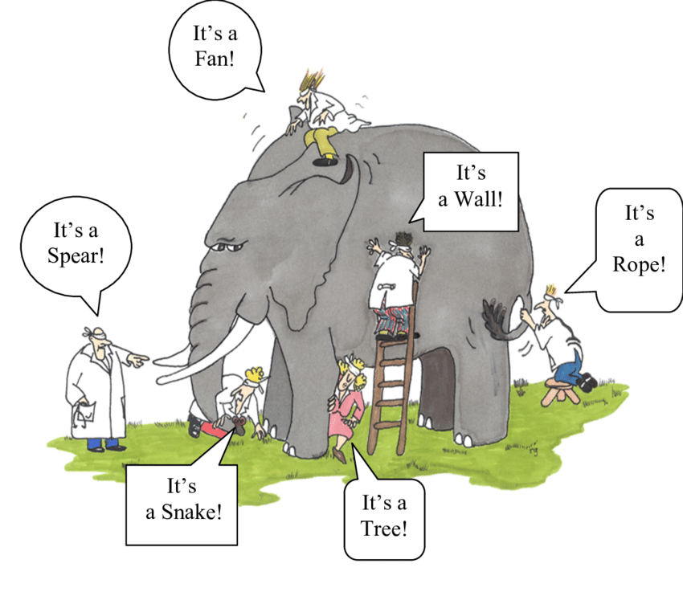
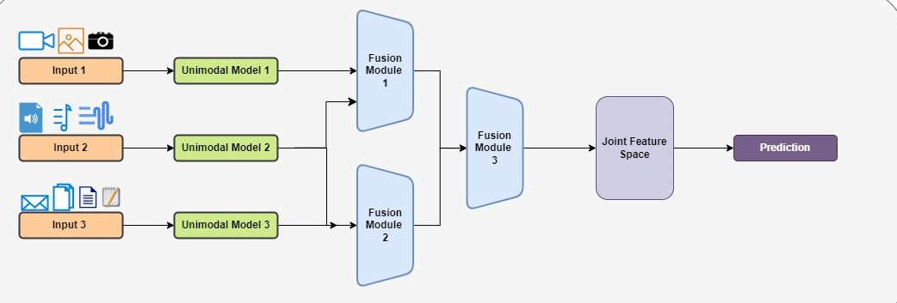

Modelos multimodales
====================

¿Que se conoce como modelos multimodales?
-----------------------------------------

Una *modalidad* se traduce como un medio o forma en lo que **algo** existe o es ejecutado. La idea de que "algo existe en una o varias modalidades" hace referencia a que sean cuales sean los atributos que definen la existencia de un objeto (o idea), este objeto puede ser persivido a traves de estas modalidades. La totalidad de la información almacenada en *algo* es entonces la sumatoria de la información de cada una de las modalidades.

  *Creditos de la imagen: https://huggingface.co/learn/computer-vision-course/en/unit4/multimodal-models/a_multimodal_world*

Ejemplos de modalidades en procesamiento de datos no estructurados incluye:

- Vision (imágenes)
- Texto
- Audio

Un modelo multimodal es un modelo que puede utilizarse para procesar datos procedentes de múltiples modalidades simultáneamente. Estos modelos combinan las singularidades y fortalezas de diferentes modalidades para crear una representación completa de los datos, mejorando así el rendimiento en múltiples tareas. Los modelos multimodales están entrenados para integrar y procesar datos de fuentes como imágenes, vídeos, texto, audio, etc. 

En general, estos modelos comienzan con multiples entradas y modelos que procesan una sola modalidad. Las salidas de estos modelos unimodales son en general embeddings que se fusionan entonces mediante una estrategia dada. La estrategia de fusión puede ser temprana, tardía o híbrida, dependiendo de que tan temprano o tarde la información es combinada en un único espacio latente.

Modelos y conjuntos de datos multimodales
-----------------------------------------

Los modelos suelen estar diseñados para completar una tarea en particular, por lo cual un modelo esta atado a una tarea en paricular. Cada modalidad suele tener diferentes tareas relacionadas a la misma. A lo largo de este curso, hemos visto varios casos de estas tareas. Por ejemplo, para la modalidad de imagenes, tareas como clasificación de imagenes, segmentación, detección, etc.

.. note:: En este contexto, es importante remarcar la capacidad de algunos modelos de realizar ::doc::`../nlp/neural/few_shot_classification`. Estos modelos siguen estando entrenados para realizar una tarea en particular, sin embargo, la versatilidad de sus datos de entrada y salida les permite ser utilizados para generar predicciones de otras tareas. 

Los modelos multimodales, entonces, también tienen asociadas tareas especificas, las cuales son también denominadas *multimodales*. Ejemplos son:

:Image captioning: Analiza una dada imagen y genera un texto que describe el entendimiento de la misma.
:Image grounding: Permite conectar el uso del lenguaje con determinadas regiones de una imágen. Por ejemplo, dado una imagen y un texto "manzana mordida", el modelo retornaria el área de la imagen donde se encuentra el objeto.
:Visual question-answering: Permite responder preguntas sobre una determinada imagen. Es decir, dada una imagen y una pregunta, el modelo retorna la respuesta a la pregunta basandose en la información de la imágen.
:Text-to-image generation: Permite generar una imagen a partir de una descripción en texto. Difusores son un ejemplo de estos modelos. También existe su variación *text-image-to-image* los cuales toman un par de imagen-texto y generan otra imagen a partir de las mismas. Técnicas de restauración o de edición de imagenes por ejemplo pueden entrar en esta categoría.
:Audio-text generation: Estos modelos permite generar texto o audio a partir de texto o audio. Son populares en sistemas basados en chat.

.. note:: Modelos de *text-to-speech* (tts) o *speech-to-text* en general no suelen denominarse modelos multimodales, a pesar de entrar dentro de la definición.

Modelos vs sistemas
~~~~~~~~~~~~~~~~~~~

Como último punto, es importarte poder diferenciar los sistemas de software de las piezas que los componen. Mientras un modelo puede estar asociado con una tarea, multiples modelos pueden ser combinados entre si para generar un único sistema inteligente, capaz de procesar multiples tipos de información. Puede que encuentre en la industria la mención de *modelos* cuando en realidad se refieren a *sistemas que utilizan modelos* y se recomienda conservar una visión crítica de la utilizaciónd de la palabra.

Un modelo multimodal no es equivalente a un sistema multimodal (compuesto de multiples modelos unimodales). La diferencia aqui radica que un modelo multimodal a sido entrado especificamente para resolver la tarea utilizando multiples modalidades. Por el contrario, un sistema multimodal esta computesto por multiples modelos que realizan tareas de forma independiente que luego son combinadas para resolver la tarea final.

.. toctree::
   :maxdepth: 2
   :caption: En esta sección
   :hidden:

   Vision-language transformers <vlp>

