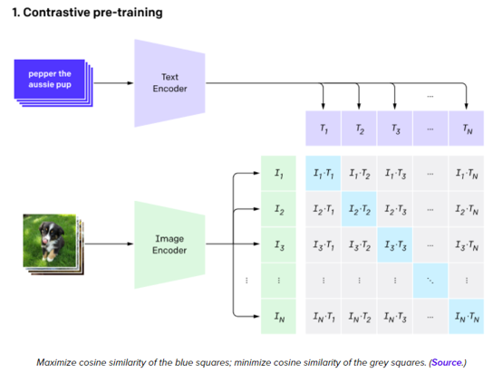

Vision-Language Pre-training (VLP)
==================================

Modelos como CLIP (que veremos en esta sección) y sus similares representaron un cambio de paradigma en la forma de trabajar con modelos multimodales que procesan texto e imágenes. Estos modelos poseen capacidades únicas que se pueden aplicar a varias tareas de aprendizaje automático al combinar aspectos del lenguaje con entendimiento de imágenes. Esta categoría de modelos suele denominarse *Vision-Language Pre-training (VLP)*.

Contrastive Language-Image Pre-training (CLIP)
----------------------------------------------

`CLIP (Contrastive Language-Image Pre-Training) <https://openai.com/blog/clip/>`_ es un modelo creado por OpenAI en Enero de 2021. Se trata de un modelo que combina el conocimiento del idioma con la semántica de las imágenes. El mismo fué entrenado sobre **400M de imágenes y sus respectivas descripciones**. Si bien este modelo no alcanzó una performance mejor que las de otros modelos de la industría que ya estan establecidos, CLIP es muy útil en aquellos escenarios donde los datos de entrenamiento son escasos. Esto se lo debe a sus capacidades de generalización y de **Zero-shot Learning**. En esta configuración, si por ejemplo quisieramos que CLIP resuelva un problema de clasificación puntual, uno solo debe "describir las etiquetas" sobre las que quiere que el modelo opere. CLIP es capaz de resolver la tarea a pesar de nunca haber sido entrenado para esa etiqueta en particular.

Arquitectura
~~~~~~~~~~~~

CLIP es capaz de generalizar más alla de las imagenes que posee en su conjunto de datos de entrenamiento gracias al contexto que le aporta el texto de las mismas. Esto hace que CLIP sea capaz de extraer representaciones de imagenes utilizando la descripción textual de la misma a pesar de nunca haber visto una imágen tal cual se describe. Esto lo vuelve extremadamente potente para la búsqueda semántica de imágenes.

  *Arquitectura general del modelo CLIP y su uso de la técninca Contrastive Learning* [4]_

La técnica de entrenamiento de CLIP esta basada en **Constrastive Learning**. Para más información sobre esta técnica y como se implementa puede ver `Contrastive Learning: Effective Anomaly Detection with Auto-Encoders <https://santiagof.medium.com/contrastive-learning-effective-anomaly-detection-with-auto-encoders-98c6e1a78ada>`_

.. toctree::
   :maxdepth: 1
   :caption: Ejemplos
   :glob:

   CLIP <clip.ipynb>

GroupViT
--------

`GroupViT <https://arxiv.org/abs/2202.11094>`_ es un modelo que inova en el ambito de la segmentación de imagenes al aplicar las ideas y aspectos de lenguaje que introdujo CLIP con el entendimiento semantico de una imagen.

BLIP
----

Modelos como CLIP mostraron el inmenso potencial de los conjuntos de datos más grandes y el aprendizaje contrastivo (constrastive learning) en el aprendizaje profundo. Un avance significativo en este ámbito es`BLIP (Bootstrapping Language-Image Pre-training for Unified Vision-Language Understanding and Generation) <https://arxiv.org/abs/2201.12086>`_ que amplía las capacidades de los modelos multimodales para incluir la generación de texto.

Idea
~~~~

Vimos que las arquitecturas basadas en transformers requieren grandes conjuntos de datos para entrenarse. A menudo es necesario extraer estos conjuntos de datos de internet utilizando pares de imágenes y texto alternativo (alt-text). Sin embargo, los textos alternativos no suelen describir con precisión el contenido visual de las imágenes, lo que los convierte en una señal ruidosa, insuficiente para el aprendizaje de la alineación entre visión y lenguaje. 

BLIP introdujo un mecanismo de filtrado (CapFilt). Este se compone de un modelo de aprendizaje profundo que filtra las muestras ruidosas y otro modelo que crea subtítulos para las imágenes. Ambos modelos se ajustan primero utilizando un conjunto de datos anotado manualmente. La limpieza del conjunto de datos con CapFit produjo un rendimiento superior al del conjunto de datos web.

Arquitectura
~~~~~~~~~~~~

La arquitectura BLIP combina varios componentes que hemos visto anteriormente:

:Vision Transformer (ViT):
:Text Encoder: Similar al que vimos con la arquitectura de  BERT, codifica el texto para el modelo.
:Image-Grounded Text Encoder: Este componente particularmente es nuevo en este curso, aunque su idea es simple. Combina la información del texto con la información de la imagen dentro del espacio de embeddings, generando asi una representación latente multimodal.
:Image-Grounded Text Decoder: Se trata del componente homologo al encoder anterior. Este decoder es entrenado via una función de perdida de cross-entropy de forma autoregresiva para resolver tareas de generación de texto como podria ser generación de subtitulos o generación de texto como respuestas a preguntas (visual-question answering).

.. toctree::
   :maxdepth: 1
   :caption: Ejemplos
   :glob:

   BLIP <blip.ipynb>
