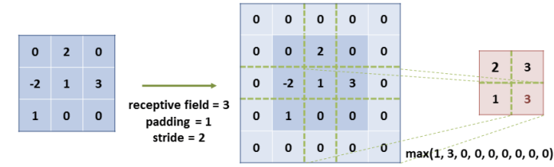

Red Neuronal Convolucional
==========================

Motivacion
----------

Los modelos basados en redes neuronales han tenido un enorme exito en el pasado. Sin embargo, en lo que respecta a procesamiento de imágenes se encuentran con 2 desafíos:

:Número de parámetros: Las imágenes son estructuras complejas con una gran cantidad de predictores (recordemos que estos predictores son cada uno de los valores de intensidad de sus pixeles). Incluso una imágen pequeña en blanco y negro representaría vectores de entrada de, por ejemplo, 28 × 28 × 1 = 784 valores cada una. Considerando una entrenamiento con lotes de 64 imágenes, esto significa una matriz de pesos en la primera capa de la red con dimensiones (784, 64). Esto equivale a 50,176 (784 × 64) valores de parámetros para optimizar, ¡solo para esta capa! Imaginese estos valores cuando hablamos de imágenes más grandes, a color, y con redes neuronales profundas. Simplemente esto no funcionará.
:Estructura espacial: Debido a que las capas están completamente conectadas las unas con las otras, cada neurona recibe todos los valores de la capa anterior. Estas redes neuronales no tienen una noción de distancia / espacialidad. Es decir, no da lo mismo en que posición de la imágen se encuentra cada valor de pixeles. Es más, los varoles arededor de un pixel tienden a estar correlacionados. Esto significa que la noción de proximidad entre píxeles se pierde en capas completamente conectadas (FC).

CNNs
----

Las redes basadas en CNN o **Red Neuronal Convolucional** ofrecen soluciones simples a estas deficiencias. Si bien funcionan de la misma manera que las redes neuronales que ya hemos revisado, se introdujeron algunos cambios en su arquitectura:

#. Se organizan las neuronas en una estructura tridimensional: alto, ancho y profundidad.
#. A diferencia de las redes completamente conectadas, donde las neuronas están conectadas a todos los elementos de la capa anterior, aquí cada neurona solo tiene acceso a los elementos en la región cirundante. Esta región (generalmente cuadrada y que abarca todos los canales) se denomina campo receptivo o **receptive field** de la neuronas y sus dimensiones están dadas por el **tamaño del filtro**:

  *(Izquierda) Red neuronal completamente conectada donde todas las neuronas están conectadas a todos los píxeles de la imagen. (Derecha) Red conectada localmente donde solo un subconjunto de píxeles está conectado a cada neurona.*

Componentes principales
-----------------------

La arquitectura de este tipo de modelos está basada en 3 tipos de capas principalmente: `Convolucional`_, `Pooling`_ y `Completamente conectada`_.

.. _rst_cnn_conv_layer:

Convolucional
^^^^^^^^^^^^^
Las redes basadas en CNN obtienen su nombre debido a esta capa, ya que son el corazón de su arquitectura. En estas capas, el número de parámetros se reduce al compartir los mismos pesos y sesgos entre todas las neuronas conectadas al mismo canal de salida. Una forma practica de pensarlo es que en lugar de conectar cada neurona a todos los pixeles de la imagen, cada una de ellas está conectada solamente a un conjunto limitado de pixeles que la rodean en cada *paso*. Esta neurona se va desplazando por toda la imagen, paso a paso, hasta lograr cubrir toda la imagen de entrada.

El conjunto limitado de pixeles a los que está conectada cada neurona se lo llama **filtro o kernel**, y en general tienen dimensiones *(k, k)*, es decir son cuadrados, pero esto no mandatorio. Estos filtros toman una entrada de dimensiones :math:`(k, k, D)` y combinan linealmente los valores para luego aplicar una función de activación no lineal. Repitiendo esta operación para cada posición que el filtro puede tomar sobre la imagen hasta cubrirla por completo, el resultado es una matriz de activación, llamada *activation map*, de dimensiones :math:`(H_f, W_f, D)`, siendo :math:`H_f` y :math:`W_f` la cantidad de veces que el filtro *f* pudo desplazarce sobre la imagen de entrada. *D* representa la cantidad de canales que posee la entrada.

Una capa convolucional puede tener N diferentes *neuronas* las cuales generarían N diferentes **filtros** o **kernels**. Esto quiere decir que las dimensiones de salida de una capa convolucional será :math:`(H_f, W_f, N)` donde *N* es el numero de filtros y :math:`H_f` y :math:`W_f` la cantidad de veces que el filtro *f* pudo desplazarce sobre la imagen de entrada.

.. note:: Note que aquí la cantidad de parámetros a aprender se ha diminuido notoriamente. Una capa de convolucion aprende los pesos y sezgos de cada filtro, siendo cada filtro una matriz de dimensiones *D* x *k* x *k*, resultando en :math:`N*(D*k_2 + 1)`. Comparado con los pesos y sezgos en una red completamente conectada de :math:`(H x W x D) x (H_f, W_f, N)`, es signficatimante menor. ¡Note también que la cantidad de parametros no depende de la resolución de la imágen de entrada!

Esto nos da propiedades muy interesantes:

- Podemos entrar redes convolucionales sobre imagenes de gran tamaño sin impactar la cantidad de parametros.
- Los filtros que se aprenden pueden ser aplicados a cualquier imagen, independientemente de sus dimensiones.
- La capacidad de generar N diferentes filtros le da la posibilidad a la red a reaccionar a N diferentes patrones, los cuales podriamos pensarlos como carácteristicas o features **locales** (es decir, confinadas a pequeñas regiones del espacio).

La respuesta de un filtro sobre una imagen de entrada representa todas las ubicaciones donde el filtro fue activado en relación a la feature que representa. Es decir, podemos pensarlo como el resultado de detectar el filtro en cada parte de la imagen. Estos resultados se los suele llamar **feature map**. Una capa entonces que tiene N filtros retornará N diferentes **feature maps**.

.. figure:: ../_images/cnn_activation.gif
  :alt: Ejemplo de convolución

  *Mapa de activaciones*

Parametros
**********

Una capa convolucional esta definida por los siguientes parámetros:

:Número de filtros: La cantidad de filtros o características a generar.
:Número de canales: La cantidad de canales de entrada.
:Tamaño de sus filtros: En general, utilizaremos filtros de tamaño cuadrados, por lo tanto este parámetros es el número *k*.
:Stride: Representando si queremos que el filtro se aplique moviendose por cada posición de la imagen posible (stride=1) o cada *s* cantidad de posiciones (stride=s). Note que cuando *s* es más grande el filtro da *saltos* mas grandes sobre la imagen de entrada. Es decir, cuanto más chico es, más sensible es a variaciones en la imagen.
:Padding: Permite *agrandar* las dimensiones de la imagen de forma sintética al rodearla con ceros. Esto en general lo haremos para poder pasar un filtro y activarlo sobre cada pixel de la entrada, incluyendo los que están cerca de la entrada. Un pading de `p = floor(k, 2) + 1` permite pasar un filtro de dimensiones *k* por ejemplo.

Estos parametros afectan las dimensiones de salida siendo estas:

.. math::

    H_f = \frac{ H - k + 2*p }{s} + 1

.. math:: 
    
    W_f = \frac{ W - k + 2*p }{s} + 1

Ejemplo
*******

En `TensorFlow`, podemos crear una capa convolucional de la siguiente forma:

.. code::

  import tensorflow as tf
  from tensorflow.keras import datasets, layers, models

  model = models.Sequential()
  model.add(layers.Conv2D(32, (3, 3), activation='relu', input_shape=(32, 32, 3)))
  (...)

Donde:

- 32 es la cantidad de filtros de la capa
- (3, 3) son las dimensiones del filtro
- 'relu' es la función de activación no lineal.

Los parametros `padding` o `strike` no fueron indicados, lo que significa que utiliza los valores por defecto de `padding=None` y `strike=1`. Esto indica que los tensores resultantes de esta capa tienen dimensiones `(30, 30, 32`. Si por el contrario `padding=1 o padding='same'`, el resultado hubiera sido tensores de dimensiones `(32, 32, 32)`.

.. _rst_cnn_pool_layer:

Pooling
^^^^^^^

Las capas de tipo `pooling` son un tanto particulares ya que no tienen parámetros para aprender. En estas capas, cada neurona está conectada a un subconjunto de valores circundantes (similar a la capa de convolución), pero solo retorna un valor al computar una función estadística predefinida sobre el mismo. El objetivo principal de esta capa es reducir la dimensionalidad espacial de los datos al forzar a la red a comprimir su información. Se puede pensar a esta capa como un "muestreo". Esto ademas trae como ventaja reducir la cantidad de parámetros de la red y también el tiempo de entrenamiento.

Estás funciones pre definidas normalmente son **max-pooling** o **average-pooling**.

- Max-pooling retorna solo el máximo valor en cada canal de la zona sobre la que se aplica (receptive field).
- Average-pooling retorna el promedio de todos los valores en cada canal en la zona sobre la que se aplica (receptive field).

Parametros
**********

Los parámetros de este tipo de capa son:

:Función: Estás funciones pre definidas normalmente son **max-pooling** o **average-pooling**.
:Stride: Cuyo significado es el mismo que en la capa de convolución. En general este valor es igual al tamaño del filtro que se utilizó en la capa de convolución. El objetivo de esto es evitar que el mecanismo de pooling se *solape* en varias regiones de la imagen de entrada.
:Padding: Cuyo signficado es el mismo que en la capa de convolución.

  *Pooling*

Ejemplo
*******

En `TensorFlow`, podemos crear una capa pooling de la siguiente forma:

.. code::

  import tensorflow as tf
  from tensorflow.keras import datasets, layers, models

  model = models.Sequential()
  model.add(layers.Conv2D(32, (3, 3), activation='relu', input_shape=(32, 32, 3)))
  model.add(layers.MaxPooling2D((2, 2)))
  (...)

Donde:

- (2, 2) son las dimensiones del campo receptivo donde se aplica la capa
- 'MaxPooling2D' es la función predefinida, siendo esta `max-pooling`. `AveragePooling2D` podría ser utilizada en su lugar.

Los parametros `padding` o `strike` no fueron indicados, lo que significa que utiliza los valores por defecto de `padding=None` y `strike=1`. Esto indica que los tensores resultantes de esta capa tienen dimensiones `(15, 15, 32)`. 

.. note:: Note como esta capa no reduce la cantidad de filtros resultantes, sino que reduce las dimensiones de los mismos.

.. figure:: ../_images/cnn_pooling.gif
  :alt: Pooling

  *Pooling*

.. warning:: El principal objetivo de la capa de pooling es la de reducir el número de parámetros en la red. Cuantos más parámetros tenemos, más complejo computacionalmente se vuelve. Existen muchas corrientes que están en contra de utilizar estas operaciones de pooling sosteniendo de que se puede lograr lo mismo utilizando `padding` en las capas de CNN con valores más grandes. Para exlorar estas alternativas recomendamos la lectura de `Jost Tobias Springenberg, Alexey Dosovitskiy, Thomas Brox, and Martin Riedmiller, "Striving for Simplicity: The All Convolutional Net" <https://arxiv.org/abs/1412.6806>`_ .

Completamente conectada
^^^^^^^^^^^^^^^^^^^^^^^

Las capas completamente conectadas son exactamente las mismas que utilizamos en redes neuronales convencionales. A pesar de que vimos que estas capas representan problemas al utilizarla con tipos de datos de imagen, las mismas son utiles en las últimas capas de una arquitectura basada en CNN. En general se las utiliza para convertir características o predictores multidimencionales en vectores unidimensionales o para conectar un clasificador.

.. code::

  model.add(layers.Flatten()) # Vector unidimensional
  model.add(layers.Dense(10), activation='softmax') # Clasificador

