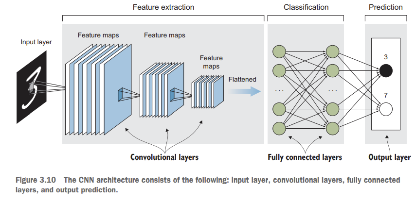
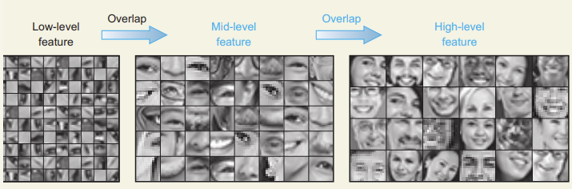
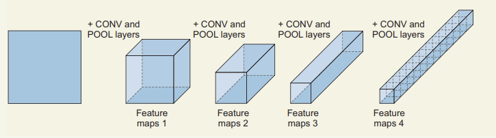

Arquitectura de redes basadas en CNN
====================================

A alto nivel
------------

A alto nivel, la arquitectura de una red neural convolucional esta compuesta por:

- Una capa de entrada que representa las imagenes.
- Una o multiples capas de la arquitectura base de CNN para la extracción de predictores, llamados *feature maps*.
- Una o multiples capas que controlan la regularización de la red.
- Una o multiples capas completamente conectadas.
- Un estimador.

Extracción de predictores
-------------------------

Podemos pensar de este paso cómo la capacidad del modelo de tomar las imágenes de entrada y dividirlas en pequeñas piezas que representan características o predictores interesantes. Estas características luego son apiladas en un vector para luego ser utilizada, por ejemplo, por un clasificador.

  *Extracción de predictores*

En general apilaremos una :ref:`rst_cnn_conv_layer` seguida de una :ref:`rst_cnn_pool_layer` para generar nuestro mapa de predictores o *feature map*. Luego de la capa de convolución, la imágen mantiene (usalmente) sus mismas dimensiones pero su profundidad aumenta. Recuerde que las capas de convolución no aprenden un filtro sino que aprenden muchos, cada uno con una tarea específica. Para reducir este aumento en la dimensionalidad, aplicamos una :ref:`rst_cnn_pool_layer` la cual genera el efecto opuesta que la anterior: mantiene la misma profundidad pero disminuye la superficie de la imágen. 

Cuando aplicamos esta estructura de forma repetitiva, el resultado es un proceso que va desde *feature maps* conceptuales a *features* densas:

  *Modificación de las dimensiones de las imágenes durante la extracción de predictores*

En TensorFlow esto luciría como sigue:

.. code::

  import tensorflow as tf
  from tensorflow.keras import datasets, layers, models

  model = models.Sequential()
  model.add(layers.Conv2D(32, (3, 3), padding='same', activation='relu', input_shape=(32, 32, 3)))
  model.add(layers.MaxPooling2D((2, 2)))
  model.add(layers.Conv2D(64, (3, 3), padding='same', activation='relu')
  model.add(layers.MaxPooling2D((2, 2)))
  model.add(layers.Conv2D(64, (3, 3), padding='same', activation='relu')
  model.add(layers.MaxPooling2D((3, 3)))
  (...)

.. note:: Note que a medida que apilamos capas de convolucionales y de pooling, las dimensiones de la imagen se comprimen, pero la cantidad de canales aumentan. Estos canales son los *feature maps*. Conceptualmente podemos pensar de estos pasos como la capacidad de aprender representaciones cada vez más abstractas de la imágen original.

El estimador
------------

Después de pasar la imagen a través del proceso de aprendizaje de características utilizando capas convolucionales y pooling, tendremos todas las características que describen la imagen. Ahora es el momento de utilizar estas características para resolver el problema en cuestión. Utilizaremos capas completamente conectadas para resolver este problema.

Por ejemplo, un estimador que clasifica imágenes en 6 diferentes categorias podría implementarse de la siguiente forma:

.. code::

  import tensorflow as tf
  from tensorflow.keras import datasets, layers, models

  (...)
  model.add(layers.Flatten())
  model.add(layers.Dense(64, activation='relu'))
  model.add(layers.Dense(6, activation='softmax'))

Regularización
--------------

La principal causa de una mala performance en modelos de aprendizaje automático basados en redes profundas es el `overfitting` o el `underfitting`. Underfitting sucede cuando el modelo no se ajusta a los datos de entrenamiento. Esto sucede cuando el modelo es demasiado simple. El overfitting, por otro lado, significa ajustar demasiado a los datos. Esto sucede cuando la red memoriza los datos de entrenamiento y no aprende como generalizar. Esto sucede cuando creamos una súper red que se ajusta perfectamente al conjunto de datos de entrenamiento (error muy bajo durante el entrenamiento), pero no se generaliza a otras muestras de datos que no había visto antes.

Las técnicas que nos ayudan a mitigar el overfitting en general se las encuentra dentro de la categoría de **regularización**. Existen muchas formas de introducir regularización, pero una de ellas es **dropout**.

Dropout
^^^^^^^

Una capa de Dropout es una de las capas más utilizadas para evitar el overfitting. La misma "apaga" un porcentaje de neuronas de forma aleatoria. Simplemente las desconecta. Por "apaga", nos referimos a que estas neuronas no son tenidas en cuenta durante la fase de entrenamiento. Puede parecer contradictorio querer eliminar conexiones de forma aleatoria, pero a medida que una red se entrena algunos nodos pueden dominar a otros o terminar cometiendo grandes errores. Al desconectar neuronas aleatoriamente le brindamos a la red una forma de equilibrar la contribución que los nodos realizan para que todos trabajen por igual hacia el mismo objetivo. Si uno comete un error, no dominará el comportamiento del modelo. Puede pensarlo como una técnica que hace que una red sea resistente: todos los nodos trabajan en equipo asegurándose de que ningún nodo sea demasiado débil o demasiado fuerte.

En redes CNN, una práctica típica es inyectar este tipo de capas entre las capas completamente conectadas ya que las mismas trabajan mucho mejor en este tipo de capas. En TensorFlow esto luciría como sigue:

.. code::

  import tensorflow as tf
  from tensorflow.keras import datasets, layers, models

  (...)
  model.add(layers.Flatten())
  model.add(layers.Dropout(0.3)
  model.add(layers.Dense(64, activation='relu'))
  (...)

.. note:: El porcentaje de neuronas que se desconecta es un hiperparámetro que se debe indicar.

Construyendo nuestro modelo
---------------------------

Uniendo todas las piezas, la arquitectura general de la red resultate terminará siendo:

.. code::

  import tensorflow as tf
  from tensorflow.keras import datasets, layers, models

  model = models.Sequential()
  model.add(layers.Conv2D(32, (3, 3), padding='same', activation='relu', input_shape=(32, 32, 3)))
  model.add(layers.MaxPooling2D((2, 2)))
  model.add(layers.Conv2D(64, (3, 3), padding='same', activation='relu')
  model.add(layers.MaxPooling2D((2, 2)))
  model.add(layers.Conv2D(64, (3, 3), padding='same', activation='relu')
  model.add(layers.MaxPooling2D((3, 3)))
  model.add(layers.Flatten())
  model.add(layers.Dropout(0.3)
  model.add(layers.Dense(64, activation='relu'))
  model.add(layers.Dropout(0.5))
  model.add(layers.Dense(6, activation='softmax'))

.. warning:: Es recomendable utilziar primero aquellas arquitectura conocidas que fueron diseñadas, ya que muchas personas ya han hecho el trabajo de juntar las cosas y ver qué funciona y que no. En términos prácticos, a menos que esté trabajando en problemas de investigación, comenzar con una arquitectura de CNN que ya haya sido construida y probada es altamente recomendable.