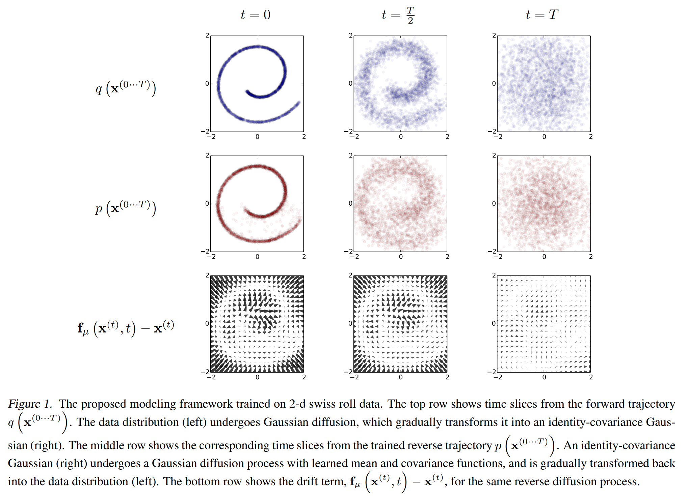

Diffusers para visión
=====================

Rencientemente, los modelos generativos de imágenes han tenido un gran impulso en el ámbito de visión por computadora. Modelos como `OpenAI DALL-E <https://openai.com/product/dall-e-2>`_ han demostrado ser extremadamente eficientes en generar imágenes sintéticamente con gran fidelidad. Estos modelos, están basados en el concepto de **difusores** o en Inglés **diffusers** los cual proponen una arquitectura específica para generar imágenes sintéticamente demostrando gran capacidad.

Introducción
------------

La idea detras de diffusers fué introducida en el paper `Deep Unsupervised Learning using Nonequilibrium Thermodynamics <https://arxiv.org/abs/1503.03585>`_ en 2015. Sin embargo, no pasó a la primera plana hasta el 2021 donde estos modelos superaron a los modelos basados en convolución y GANs. Si bien los modelos basados en GAN demostraron ser el estado del arte durante mucho tiempo, los mismos no logran capturar por completo la diversidad de la distribución de las imágenes (la cual es altamente compleja). Esto se debe a que los modelos basados en GANs prefieren fidelidad antes que diversidad (es decir que prefieren generar imágenes de alta definición aunque sin capturar todo el espacio de posibilidades). Además, estos modelos son complejos de entrenar, principalmente por su capacidad de colapsar fácilmente durante el entrenamiento si no se utilizan los hiperparámetros correctos.

OpenAI, en el paper `Diffusion Models Beat GANs on Image Synthesis (2021) <https://arxiv.org/pdf/2105.05233v4.pdf>`_, propuso mejoras que llevaron a la técnica a un nuevo estandar. Finalemnte, `High-Resolution Image Synthesis with Latent Diffusion Models (2022) <https://arxiv.org/pdf/2112.10752.pdf>`_ introdujo mejoras en el proceso de generación que permitieron tener resultados sin precedentes en altas resoluciones. 

Modelos probabilísticos de difusión
-----------------------------------

Veamos primero el concepto fundamental de difusión. Los modelos probabilísticos de difusión (Diffusion probabilistic models) o **DMs**, son modelos que utilizan una cadena de Markov para gradualmente transformar una distribución conocida (gausiana) en otra distribución (la de los datos) utilizando un proceso de difusión (introdución de ruido).

Estos modelos buscan definir un proceso de inferencia (no de aprendizaje) que convierte cualquier distribución compleja en una distribución más simple, para luego - ahora si - aprender una función generativa que revierta el proceso. Es decir, que el proceso consta de dos partes: un parte donde la distribución compleja es *destruida* hasta obtener una distribución más simple, y otro proceso que intenta revertir este proceso al generar muestras de la distribución original utilizando datos de la gausiana.

  *Ejemplos de datos utilizados para entrenar modelos de difusión.*

Veamos estos dos procesos por separado:

Difussion
~~~~~~~~~

En este proceso, la distribución original es gradualmente convertida en una distribución conocida :math:`{\pi}(y)` al aplicar un kernel de difusión :math:`T_{\pi}(y | y';\beta)` donde :math:`\beta` es la taza de difusión.

.. math::
    q(x^{(t)} | x^{(t-1)}) = T_{\pi}(x^{(t)}|x^{(t-1)};\beta_t)

Luego de *T* pasos en el proceso de difusión:

.. math::
    q(x^{0..T})=q(x^0)\prod_{t=1}^{T}q(x^t|x^{t-1})

Denoise
~~~~~~~

El modelo generativo que revierte esta transoformación es entrenado sobre la misma trajectoria, pero a la inversa:

.. math::
    \displaylines{p(x^T) = \pi(x^T) \\ p(x^{1..T}) = p(x^T)\prod_{t=1}^{T}p(x^{t-1}|x^t)}

Es importante aquí que :math:`q(x^{t}|x^{t-1})` siga una distribución gausiana, lo cual fuerza que :math:`\beta` sea pequeño. Cuanto más compleja sea la distribución, más cantidad de pasos entonces serán necesarias (dado que aplicamos difusiones pequeñas).

Una forma de parameterizar este modelo es como una función que predice el el componente de ruido de una muestra :math:`x^t` para así obtener :math:`x^{t-1}`. Note que esta configuración es similar a un Variational Autoenconder (VAE), solo que en lugar de intentar reconstruir la misma instancia de datos `x^t`, intenta reconstruir una versión con menos ruido, es decir, :math:`x^{t-1}`.

Arquitecturas
-------------

Como mencionamos anteriormente, los modelos de difusión, en realidad, están compuestos por varias piezas. Algunas de las piezas más importantes:

- El modelo generativo, que en general llamaremos **diffusion model** (a pesar que diffusion hace referencia al proceso completo).
- El proceso que programa, en cada paso *t*, como introducir ruido en la imágen. Esta información es también importante durante el proceso generativo ya que los **diffusion models** en general predicen la imagen para un paso *t*. Este componente se lo suele llamar **scheduler**. 

Diffusion model
~~~~~~~~~~~~~~~

En la mayoría de los casos, se utiliza una arquitectura conocida como **UNet**, la cual utiliza una secuencia de capas residuales con convoluciones tradicionales, seguida de unna secuencia de capas residuales con convoluciones del tipo *upsampling*, ambas secciones con conecciones *skip connections* que conectan aquellas capas que tienen las mismas dimensiones. Finalmente, una capa de atención global genera un embedding al cual se le adjunta también información del paso *t* sobre el que se está trabajando.

  
  *Arquitectura de UNet.*

Scheduler
~~~~~~~~~

El programador o scheduler es el proceso que controla la cantidad de ruido que se introduce en cada paso del proceso. La forma y cantidad de ruido que se introduce ha demostrado ser crítico para obtener modelos que ejecuten correctamente. En general, realizan las siguientes acciones:

#. Configurar la cantidad de pasos de *denosing*.
#. Iterar sobre cada uno de estos pasos.
#. Invocar al modelo de difusión para obtener los residuales.
#. Computar la muestra de datos anterior removiendo el ruido de la imágen del paso actual. 

En general, los schedulers, a diferencia de los modelos de difusión, **no son modelos con parámetros aprendidos**, sino que constan de hiperparámetros que se deben configurar. Existen en la actualidad multiples tipos de schedulers, cada uno con determinadas ventajas y desventajas. Note que, como mencionamos anteriormente, el modelo de difusión utiliza como parametro información del proceso de introducción de ruido, por lo que si bien puede utilizar diferentes modelos con diferentes schedulers, no todas las combinaciones son compatibles.

Hay dos tipos de schedulers: discretos y continous, haciendo referencia al valor que reciben para indicar el paso (t) en el que se encuentran dentro del proceso de *desnoising*. Por ejemplo, DDPM (cuyas siglas provienen del nombre del paperdonde se introdujo, Denoising Diffusion Probabilistic Models) es un tipo de scheduler discreto y uno de los más sensillos de utilizar. 

Modalidades de generación
-------------------------

Los modelos generativos en general tienen dos modalidades de generación:

:No condicionadas: El proceso de generación no está guiado ni condicionado por de ninguna forma más que por el scheduler que orquestra el proceso.
:Condicionadas: El proceso de generación está condicionado durante su proceso de *denoising*. El modelo debe generar una muestra en cada paso *t*, la cual está condicionada al modificar el estado interno del modelo generativo.

En :doc:`code/ddpm.ipynb` revisaremos un ejemplo de un modelo *no condicionado*. Veremos que, si bien produce imagenes, su utilidad es relativamente baja ya que estos modelos requieren estar entrenados especificamente en un determinado dominio para generar imagenes que correspondan al mismo. De lo contrario, dada la extremadamente alta variabilidad dentro de la distribución de posibles imagenes, el proceso de generación de imagenes no genera algun tipo de contenido más específico.

El proceso de generación puede ser condicionado de multiples formas:

- Condicionado por texto.
- Condicionado por otra imagen.
- Condicionado por texto y una imagen incial.
- Condicionado por audio.

Los hoy en día populares :doc:`code/stable_diffusion.ipynb` son un tipo de *conditioned diffusion models*. Estas arquitecturas conectan el modelo UNet con un modelo basado en transformers que le permite condicionarlo por información que es almacenada en tokens.

Latent Diffusion Models
-----------------------

A pesar de que los DMs demuestran un gran potencial para generar imágenes, sufren de un problema importante que es su costo computacional. Entrenar y evaluar estos modelos requiere computar de forma repetitiva funciones (y gradientes) en un espacio altamente dimensional (RGB). En paper `High-Resolution Image Synthesis with Latent Diffusion Models (2022) <https://arxiv.org/pdf/2112.10752.pdf>`_ introdujo el concepto de "Latent Diffusion Models", el cual ataca este problema directamente.

En lugar de utilizar las imagenes RGB directamente, primero entrena un autoencoder el cual provee un espacio dimensional comprimido (y por ende más eficiente) que es perceptivamente equivalente al espacio original de las imágenes. Luego, las arquitecturas de DMs son entrenadas sobre este espacio dimensional, el cual le permite a la técnica escalar más eficientemente. Otra ventaja de esta modalidad es que el autoencoder es universal, y puede ser utilizado en multiples DMs sin necesidad de ser reentrenado.

Dado que los DMs pueden explotar efectivamente la *localidad* de las carácteristicas, la arquitectura del autoencoder no necesita comprimir execivamente el espacio y por ende utiliza embeddings en un espacio de 2D, lo cual resulta atractivo para la arquitecture UNet que utiliza capaz convolucionales. Adicionalmente, el **encoder** también reduce la resolución de la imagen inicial antes de pasar por el proceso de autoencoding. 

  
  *Arquitectura de Stable Diffusion.*

Ejemplos
--------

.. toctree::
    :maxdepth: 1
    :caption: Ejemplos
    :glob:

    code/*
