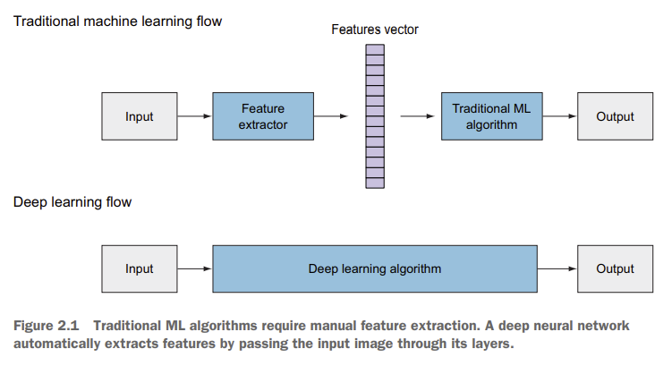

Arquitecturas neurales para visión
==================================

En los problemas tradicionales de aprendizaje automático, dedicamos una buena cantidad de tiempo a la selección e ingeniería manual de predictores. En este proceso, confiamos en el conocimiento de dominio del experto (o nos asociamos con uno) para crear características que hagan que los algoritmos de aprendizaje automático funcionen mejor. Luego conectamos estas características a un clasificador SVM o AdaBoost para predecir la salida. 

En las arquitecturas neurales basadas en aprendizaje profundo, por el contrario, no es necesario extraer manualmente características de la imagen. La red no solo aprende representaciones automáticamente sino que también aprende su importancia en la salida. Estos modelos conectan la imagen de entrada sin procesar a la red y, mientras pasa a través de las capas de la misma, la red identifica patrones dentro de la imagen con los que crear características. Estas redes neuronales se pueden considerar modelos de aprendizaje de punta a punta, a diferencia de los modelos tradicionales de ML que utilizan características hechas a mano.

Estos modelos están basados en el concepto de :doc:`representations` y sus arquitecturas están basadas principales en estructuras específicas que condicionan la forma en la que la red aprende. Estas estructuras son principalmente una :doc:`cnn`.

.. toctree::
   :maxdepth: 2
   :caption: En esta sección
   :hidden:

   Aprendizaje por representaciones <representations>
   Red Neuronal Convolucional <cnn>
   Transformers para vision <transformers>
