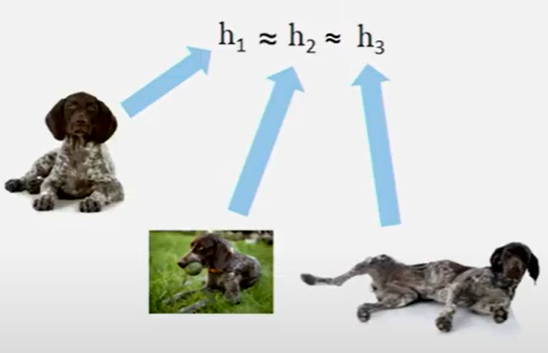
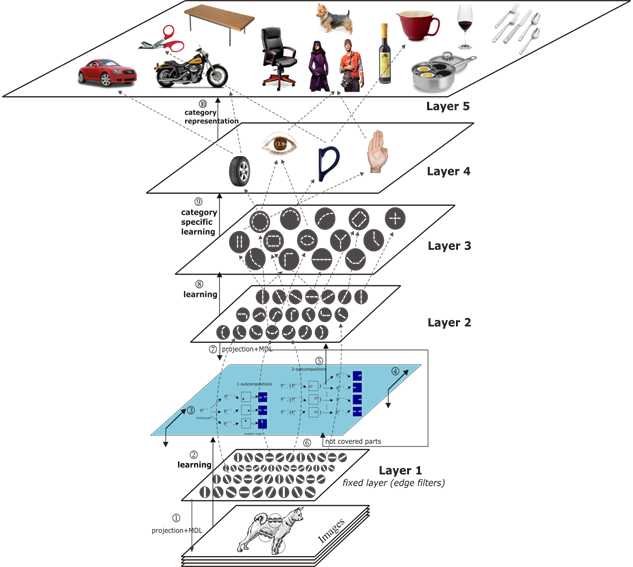

Aprendizaje por representaciones
================================

Representaciones
----------------

Una representación es una descripción a alto nivel de un objeto, la cual tiene la característica de "utilidad". Esto quiere decir que existe un beneficio o resulta práctico utilizar esta representación para describir el objeto en lugar de utilizar los datos del objeto propiamente dicho. Ese sentido de utilidad en general está asociado a una tarea en particular, pero también pueden tener un caracter más general.

  *Las representaciones de las imagenes h1, h2 y h3 son similares al representar el mismo objeto, a pesar de que las imágenes son distintas.*

La técnica de aprendizaje por representaciones o **representation learning** nos permite encontrar esta estructura de representaciones dentro de los datos de una forma no supervisada. 

Representaciones intermedias
----------------------------

El concepto de "utilidad" en las representaciones nos da la posibilidad de realizar composiciones de representaciones para formar otras más complejas. En este sentido, buscamos disponer de aprender representaciones en las cuales vayamos desde conceptos más sencillos como lineas, contornos y colores a elementos más complejos como formas o texturas. 

  *Jerarquía de representaciones para la detección de objetos.*

Las capas intermedias representan conjuntos de características, conocidas como **feature maps**, que a medida que nos desplazamos hacia las capas más profundas, representan conceptos más abstractos.

