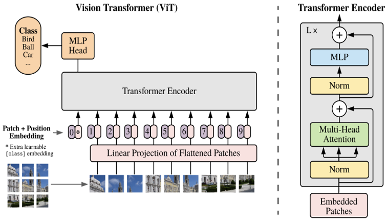
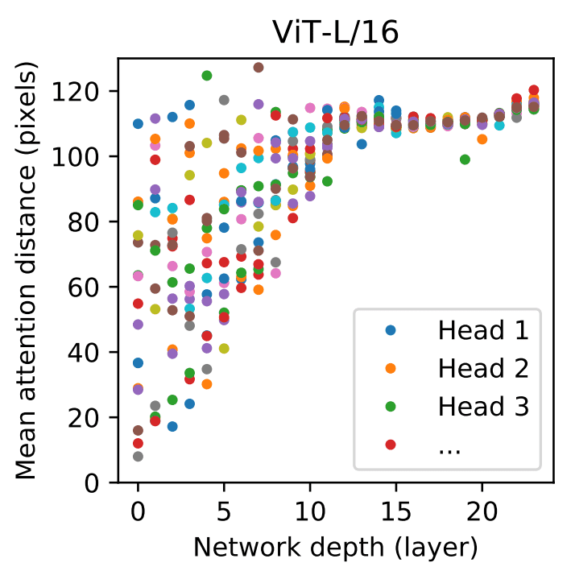

Arquitecturas basadas en transformers
=====================================

La arquitectura de :doc:`../../../nlp/neural/transformers` cambió radicalmente el estado del arte en las tareas de procesamiento de texto. Sin embargo, en el campo de visión por computadora, todos los modelos mayoritariamente descansan en la arquitectura CNN. Esto permaneció de esta forma hasta que, sobre fines de 2020, Google propuso una arquitectura para el procesamiento de imágenes basada en transformers, Vision Transformer (ViT). Las arquitecturas de modelos de visión por computadora basadas en transformers fueron propuestas en el paper `An Image is Worth 16x16 Words: Transformers for Image Recognition at Scale <https://arxiv.org/abs/2010.11929>`_. 

Fundamentos
-----------
Para poder utilizar imágenes dentro de una arquitectura basada en :doc:`../nlp/neural/transformers`, las imágenes son segmentadas (o "divididas") en pequeños parches cuadrados, los cuales son linearmente proyectados a las dimensiones de entrada que la arquitectura del transformer utiliza. La secuencia de parches resultante es injectada en un transformer tradicional. Podríamos pensar en aplicar la arquitectura de transformers directamente sobre los pixeles de las imágenes. Sin embargo, esto requeriría que cada pixels pueda "prestar atención" (attend) a cada uno de los pixeles restantes. Es conocido que las arquitecturas de atención escalan cuadraticamente con respecto al tamaño de la entrada, lo que hace esta técnica inviable en el mundo de imágenes.

  *Arquitectura básica de ViT*

Esto quiere decir que los *tokens* con los que trabajamos en NLP son en este régimen parches de una determinada cantidad de pixeles, por ejemplo, 16x16.

Una deferencia fundamental entre los modelos para NLP y visión rádica en la forma en la que son entrenamdos. Los mejores resultados en transformers para visión se han obtenido cuando estos modelos son entrenados de forma supervisada utilizando un gran conjunto de datos, lo cual no es el caso en modelos de NLP donde las grandes avances se han dado gracias a su pre-entrenamiento de forma *self-supervised*. 

.. note::
  Si bien es posible entrenar modelos de transformers para visión de forma self-supervised, como por ejemplo predecir parches faltantes en una imagen (masked patch prediction), y obtener una buena performance, la misma es aún inferior a la que se puede obtener con modelos supervisados.
  
Embeddings
----------

Una imagen de dimensiones HxW resulta en :math:`N = HW / {P ^ 2}` tokens de tamaño PxP. Cada uno de estos parches entonces resulta en un token el cual es representado en un espacio vectorial de dimension D. Cada parche de 2 dimensiones es transformado a 1 dimensión, la cual el modelo puede utilizar para aprender un mapeo a un espacio latente *D* que es constante en toda la arquitectura. Los embeddings en la dimensión *D* se los conoce como __patch embeddings__.

Finalmente, se adjunta sobre cada *path embedding* información posicional sobre cada uno de los parches que sirven para identificar la posición del mismo. 
  
Representation learning
-----------------------

Mencionamos que uno de los conceptos más importantes en visión por computadora es la idea de :doc:`resentations`. Es válido preguntarse si los mismos conceptos pueden ser aplicados o son aplicados a modelos basados en transformers. Ha sido demostrado empiricamente que los bloques de atención en las capas mas tempranas de la red tienden a presetar atención (attend) a pixeles que se encuentras tanto cerca como lejos los unos de los otros, demostrando la habilidad del modelo de integrar información de forma global (la distancia entre los puntos a los que el modelo presta atención podría interpretarce de forma análoga al *receptive field* en CNN). Sin embargo, a medida que avanzamos en la profundidad de la red, vemos que estos bloques tienen a prestar atención a regiones más distantes de la imagen, dando a entender que los mismos toman conceptos más distribuidos, semanticamente relevantes.

  *Distribución de la atención en las diferentes capas, mostrando como capas mas tempranas tienden a atender pixeles vecinos como pixeles que se encuentran alejados, mientras que capas más profundas tienden a atender a regiones más distantes.*

Los modelos basados en CNN poseen lo que se conoce como *inductive bias*, el cual hace referencia al sezgo que el modelo posee debido a la arquitectura y las restricciones de los argoritmos de aprendizaje. Particularmente, los conceptos de traslación y localidad terminan siendo útiles en conjuntos de datos pequeños. Sin embargo, a medida que los conjuntos de datos aumentan, aprender estos patrones directamente resulta suficiente, e incluso beneficioso como se muestra en las arquitecturas de transformers.
  
Ejemplos
--------

.. toctree::
    :maxdepth: 1
    :caption: Ejemplos
    :glob:

    code/vit_classification.ipynb
    code/dino.ipynb
