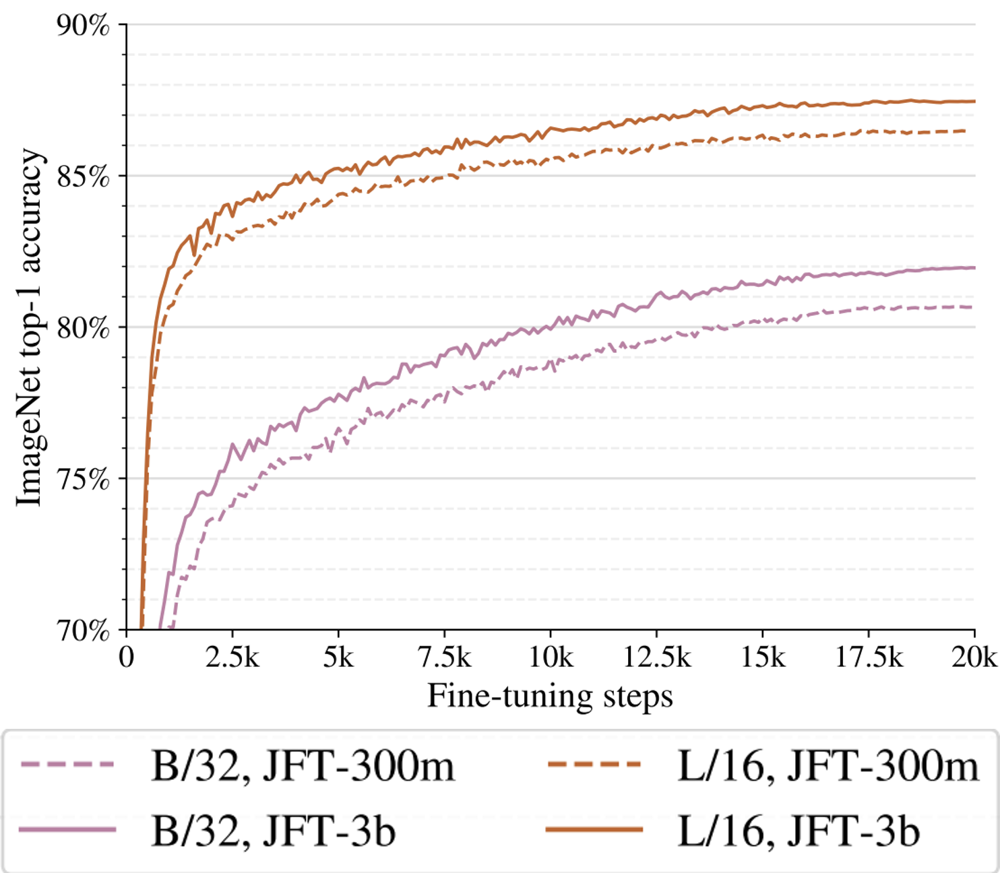
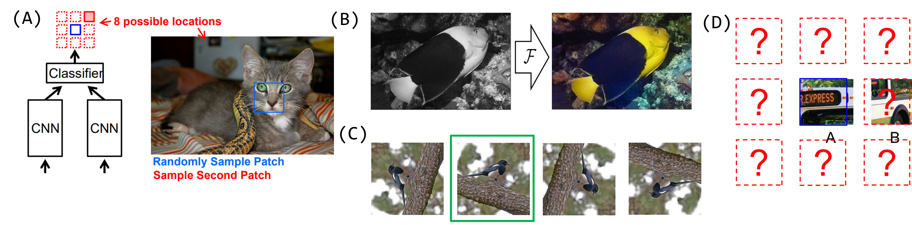

Estado del arte
===============

La era de los transformers [1]_ 
-------------------------------
La arquitectura de :doc:`../nlp/neural/transformers` cambió radicalmente el estado del arte en las tareas de procesamiento de texto. Sin embargo, en el campo de visión por computadora, todos los modelos mayoritariamente descansan en la arquitectura CNN. Esto permaneció de esta forma hasta que, sobre fines de 2020, Google propuso una arquitectura para el procesamiento de imágenes basada en transformers, Vision Transformer (ViT).

ViT es una arquitectura que aumenta significativamente el número de parámetros de la red (en la imágen que sigue, desde la linea rosa a la linea marron) y, por lo tanto, la cantidad de datos que necesita para entrenarse. Esto le ayuda a que ViT alcance un 90.45% de accuracy en el desafío de ImageNet, una performance que era el estado del arte (hasta que CoAtNet, una arquitectura que combina `self-attention` y comboluciones, lo destronara con una performance de 90.88%[2]_).

  *Numero de parametros y conjunto de entrenamiento entre arquitecturas CNN y Transfomers.*

¿Como funciona?
^^^^^^^^^^^^^^^
Para poder utilizar imágenes dentro de una arquitectura basada en :doc:`../nlp/neural/transformers`, las imágenes son segmentadas (o "divididas") en pequeños parches cuadrados, los cuales son linearmente proyectados a las dimensiones de entrada que la arquitectura del transformer utiliza. La secuencia de parches resultante es injectada en un transformer tradicional.

.. figure:: _images/state_vit_architecture.png
  :alt: Arquitectura básica de ViT.

  *Arquitectura básica de ViT*

Tareas auto-supervisadas
------------------------
*Self-supervised learning* o *aprendizaje auto-supervisado* es una forma de aprendizaje no supervisado donde se busca resolver tareas auxiliares supervisadas, en las cuales los mismos datos son quienes proveen la supervisión. Esta técnica ha dado grandes resultados en los modelos de lenguaje donde nos iteresa modelar la probabilidad de cada palabra en una secuencia de palabras, por ejemplo.

Esta misma idea puede trasladarse a visión por computadora, donde generaremos tareas adiconales que el modelo debe resolver con el afan de que, al resolver estas tareas, el modelo aprenda representaciones que son útiles para resolver otro tipo de tareas. En general, estas tareas auxiliares proponen mantener una parte de los datos constante y mientras le pedimos al modelo que prediga el resto. La performance que alcanza el modelo en estas tareas auxiliares es medida a través de una métrica de perdida sobre la cual el modelo es optimizado.

  *Tareas típicas en una configuración self-supervised para imágenes*

Entre las típicas tareas auxiliares se encuentran:

- Predicción de la ubicación de un determinado parche de la imagen (imagen A)
- Predicción relativa de la ubicación de un determinado parche de la imagen con respecto a otro (imagen D)
- Trasformar una imagen en blanco y negro para luego predecir el color de cada pixel (imagen C)
- Predicción de la orientación de la imagen (imagen B)

En general estos modelos se los entrena no solo en una tarea auxiliar, sino que en un conjunto de tareas. Estos modelos se los llaman *multi-task*. El objetivo entonces es entrenar un modelo para resolver todas estas tareas de forma supervisada con el afán de que al resolverlas haya aprendido representaciones útiles no solo para estas tareas auxiliares, sino que para otras tareas que nos interesaría resolver.

Utilizando esta técnica, `Facebook AI introdujo SEET en 2021 <https://ai.facebook.com/blog/seer-the-start-of-a-more-powerful-flexible-and-accessible-era-for-computer-vision/>`_ [3]_, un modelo de clasificación de imágenes con aprendizaje no supervisado que se entreno sobre 1B de imágenes de Instagram. Estos modelos aprenden “class-specific features leading to unsupervised object segmentations”.
Suguiriendo que este tipo de predictores no aparecen en su modalidad supervisada.

.. figure:: _images/state_self_supervised_repr.png
  :alt: Ejemplos de las representaciones generadas por un modelo entrenado con self-supervised learning.

  *Ejemplos de las representaciones generadas por un modelo entrenado con self-supervised learning* [3]_

Combinando texto con imágenes
-----------------------------

`CLIP (Contrastive Language-Image Pre-Training) <https://openai.com/blog/clip/>`_ es un modelo creado por OpenAI en Enero de 2021. Se trata de un modelo que combina el conocimiento del idioma con la semántica de las imágenes. El mismo fué entrenado sobre **400M de imágenes y sus respectivas descripciones**. Si bien este modelo no alcanzó una performance mejor que las de otros modelos de la industría que ya estan establecidos, CLIP es muy útil en aquellos escenarios donde los datos de entrenamiento son escasos. Esto se lo debe a sus capacidades de generalización y de **Zero-shot Learning**.

CLIP es capaz de generalizar más alla de las imagenes que posee en su conjunto de datos de entrenamiento gracias al contexto que le aporta el texto de las mismas. Esto hace que CLIP sea capaz de extraer representaciones de imagenes utilizando la descripción textual de la misma a pesar de nunca haber visto una imágen tal cual se describe. Esto lo vuelve extremadamente potente para la búsqueda semántica de imágenes.

.. figure:: _images/state_clip_contrastive.png
  :alt: Arquitectura general del modelo CLIP y su uso de la técninca Contrastive Learning.

  *Arquitectura general del modelo CLIP y su uso de la técninca Contrastive Learning* [4]_

La técnica de entrenamiento de CLIP esta basada en **Constrastive Learning**. Para más información sobre esta técnica y como se implementa puede ver `Contrastive Learning: Effective Anomaly Detection with Auto-Encoders <https://santiagof.medium.com/contrastive-learning-effective-anomaly-detection-with-auto-encoders-98c6e1a78ada>`_

.. [1] Fuente: https://arxiv.org/pdf/2010.11929.pdf
.. [2] Fuente: https://arxiv.org/pdf/2106.04560v1.pdf 
.. [3] Fuente: https://ai.facebook.com/blog/seer-the-start-of-a-more-powerful-flexible-and-accessible-era-for-computer-vision/  
.. [4] Fuente: https://openai.com/blog/clip/

