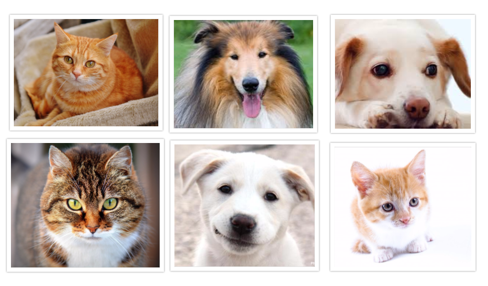
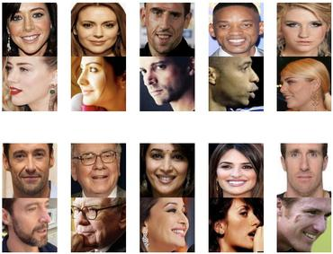
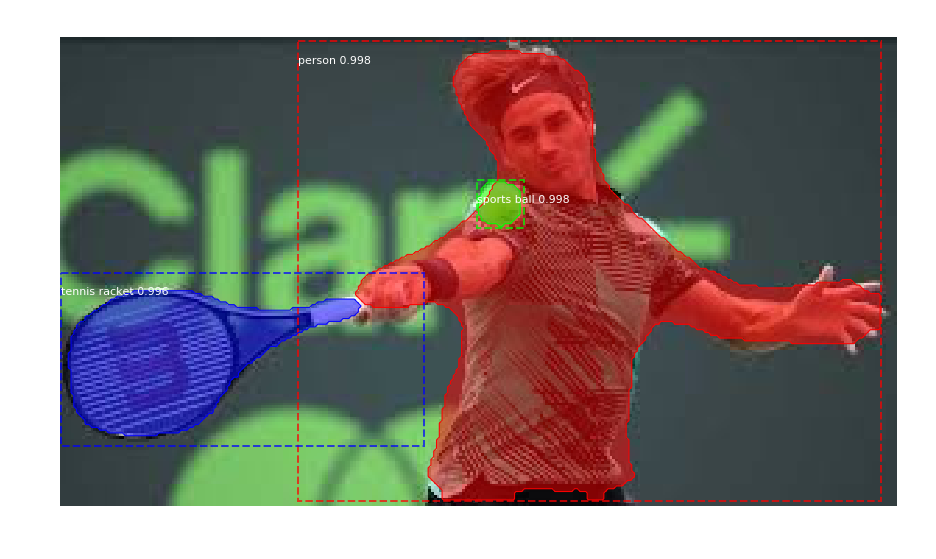
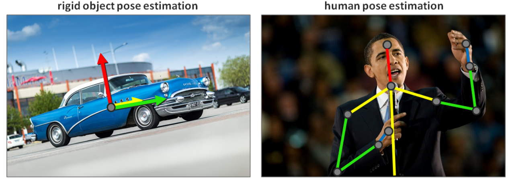

Principales tareas en el procesamiento de imágenes
==================================================

Existe un sin contar de problemas que se  pueden resolver utilizando las técnicas de visión por computadora. Sin embargo, en general suelen encuadrarse en alguna de las sigueintes tareas en particular:

.. _rst_object_classification:

Clasificación de objetos (Object classification)
------------------------------------------------

La clasificación de objetos es la tarea por la cual un modelo de aprendizaje automático asigna una o varias etiquetas a diferentes imágenes dependiendo del contenido de la misma. Esta tarea se volvió muy popular en 2012 en el contexto de aprendizaje automático ya que fué la primera tarea en alcanzar una performance sustancialmente mayor que con técnicas clásicas. 

Desde aquel entonces, el progreso en este campo ha sido tan grande que hoy en día disponemos de modelos de aprendizaje automático con performance superiores a las de un humano. Un ejemplo clásico es el de clasificación de razas de perror donde los modelos alcanzan a distinguir razas que resultan imposibles distinguir para incluso personas altamente experimentadas en esto.

  *Clasificación de objetos (Object classification)*

.. _rst_object_identification:

Identificación de objetos (Object identification)
-------------------------------------------------

La tarea de identificación de objetos puede parecer similar a la de clasificación, en principio. Busca identificar instancias de un determinado objeto en otros. Estos objetos que busca identificar pueden ser conocidos o desconocidos.

La identificación de objetos desconocidos es sencilla de ver si vemos a la tarea como un caso de clusterización. Es decir, dado un conjnuto de imágenes buscamos agrupar las imagenes dependiendo de carácteristicas que se encuentran en ellos. Esas características podrían ser objetos que no conocemos o que no hemos inidicado en etiquetas.

La identificación de objetos conocidos, por el contrario se modela como una tarea de clasificación de objetos pero donde la etiqueta a buscar no es un valor escalar sino que una representación latente de otra imágen que representa la etiqueta.

Identificación de rostros (Face recognition)
^^^^^^^^^^^^^^^^^^^^^^^^^^^^^^^^^^^^^^^^^^^^

El reconocimiento facil o de rostros es un caso particular de la identificación de objetos. Sin embargo, dada la complejidad en la tarea, en general las técnicas que se aplican suelen estar altamente refinadas para tal fin. Reconocemos 2 tipos de tareas incluso en esta sección:

:Identificación de rostros: Donde buscamos coincidencias entre una determinada cara candidata y una base de datos con multiples instancias de caras. 
:Verificación de rostros: Donde, dadas 2 imágenes de caras, buscamos verificar si efectivamente ambas instancias representan la misma persona.

  *Verificación de rostros*

.. _rst_object_detection:

Detección de objetos (Object detection)
---------------------------------------

Una tarea similar a la clasificación pero un poco más compleja es la detección de objetos, donde buscamos ademas identificar el objeto dentro de la imagen. Es decir, los modelos de detección de objetos son capaces de delimitar el areas o región de la imágen que contiene a cada uno de los objetos de interés. Suele ser una de las primeras tareas que se ejecutan sobre una imagen para luego realizar un procesamiento más profundo.

.. figure:: _images/tasks_detection.png
  :alt: Identificación de objetos (Object identification)

  *Identificación de objetos (Object identification)*

.. _rst_object_segmentation:

Segmentación de objetos (Object segmentation)
---------------------------------------------

Podemos ver a la segmentación como un tipo de detección de objetos pero más avanzada. En este caso, en lugar de simplemente proveer el área o rectangulo que contiene el objeto en cuestión, buscamos encontrar todos los pixeles que comprenden al objeto per-se. Esto hace que la tarea sea mucho más compleja y, en realidad, una de las pocas donde las redes neuronales profundas aún están lejos del desempeño humano (nuestro cerebro es de hecho notablemente eficiente para trazar los límites/contornos de una imagen).

  *Segmentación de objetos (Object segmentation)*

.. _rst_pose_estimation:

Estimación de pose (Pose estimation)
------------------------------------

La tarea de estimación de pose puede tener diferentes significados depeniendo del contexto. En lo que respecta a objetos rígidos, en general significa estimar la posición y orientación relativa al observador (la cámara). Esto es especialmente útil cuando es necesario interactuar con objetos en el mundo real.

En el contexto de personas, la estimación de la pose suele involucrar estimar la posición relativa de cada una de las partes del cuerpo. Esto en general se realiza identificando la posición de determinados puntos del cuerpo que nos permitén construir un esqueleto 3D donde podemos estimar las diferentes posturas que la persona puede tener.

  *Estimación de pose (Pose estimation)*

Generación de imágenes
----------------------

La generación de imágenes nos permiten crear nuevas instancias de una imágen utilizando métodos de aprendizaje automático. Dependiendo del objetivo que se persigue será la configuración del problema. Entre ellas:

:Super-resolution: Donde dada una imágenes de entrada en una resolución A, buscamos generar una segunda imágen con resolución B donde A < B.
:Style transfer: Donde dada una imagén de entrada y un *estilo*, buscamos generar una segunda imágen donde el estilo indicado es aplicado a la imágen de entrada.
:Image construction: Donde dada una descripción de la imagen deseada, buscamos generar una imagén que cumple con la descripción que se indicó.
:Image re-construction: Donde dada una imágen de entrada con obstrucción parcial, buscamos generar una segunda imágen donde las secciones obstruidas han sido restauradas.

.. figure:: _images/tasks_style_transfer.png
  :alt: Transferencia de estilo

  *Transferencia de estilo de La noche estrellada de Van Gogh a la imagen original, produciendo una obra de arte que se siente como si hubiera sido creada por el artista original*