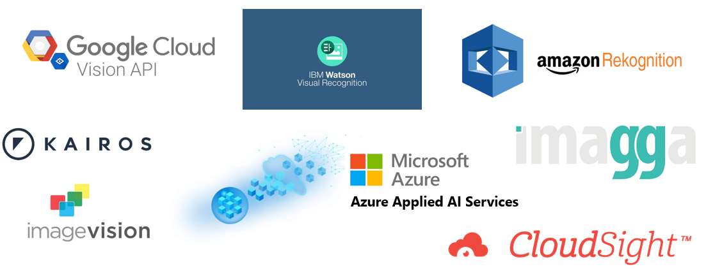

Modelos para imágenes
=====================

En esta sección, revisaremos como utilizar los conceptos que presentamos anteriormente para resolver problemas puntuales. En general utilizaremos TensorFlow como el framework de desarrollo principal, pero los mismos conceptos aplican para otros frameworks.

Clasificación de objetos (Object classification)
------------------------------------------------

La clasificación de objetos es la tarea por la cual un modelo de aprendizaje automático asigna una o varias etiquetas a diferentes imágenes dependiendo del contenido de la misma. Esta tarea se volvió muy popular en 2012 en el contexto de aprendizaje automático ya que fué la primera tarea en alcanzar una performance sustancialmente mayor que con técnicas clásicas. 

.. toctree::
    :maxdepth: 1
    :caption: Ejemplos
    :glob:

    classification/*/*

Modelos de visión de industria
------------------------------

Crear modelos de Computer Vision que tengan gran precisión y funcionen en una variedad de contextos importante no es una tarea sencilla. Requiren grandes cantidades de datos y experencia en la creación de modelos básados en Deep Learning. A medida que el procesamiento de imagenes se vuelve mas robusto, muchas organizaciones de tecnología han optado por empaquetar estos modelos de alta performance y ofrecerlos como servicios que las organizaciones pueden consumir directamente como un servicio web. Algunos provedores proveen modelos de proposito general mientras otros proveen servicios quizás mas de nicho.

  *Principales proveedores de modelos de visión de industria*

.. toctree::
    :maxdepth: 1
    :caption: Ejemplos
    :glob:

    industry/*/*
